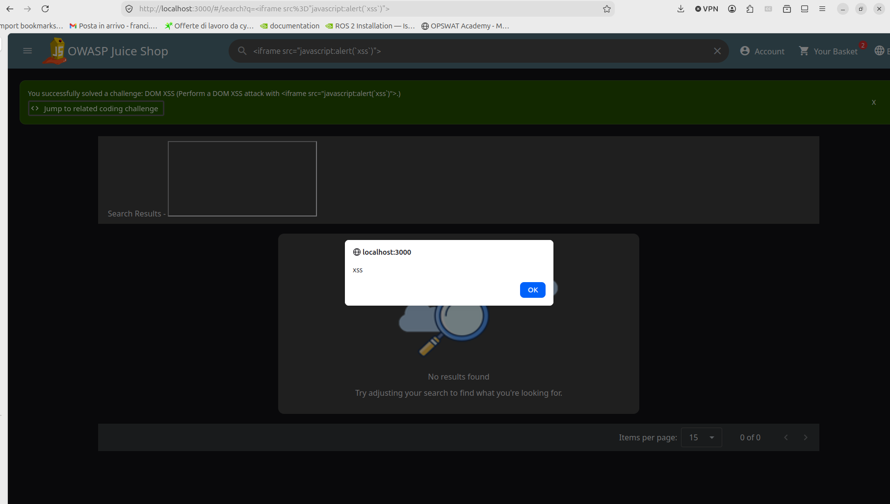
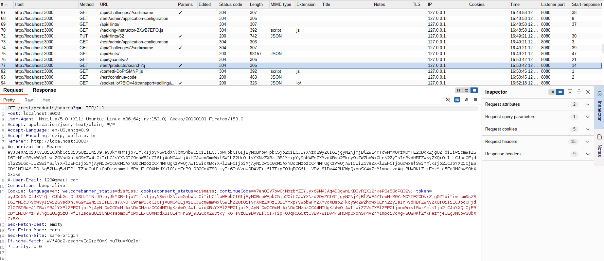
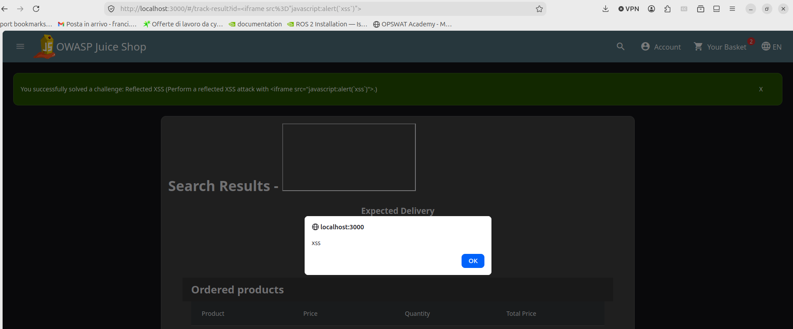
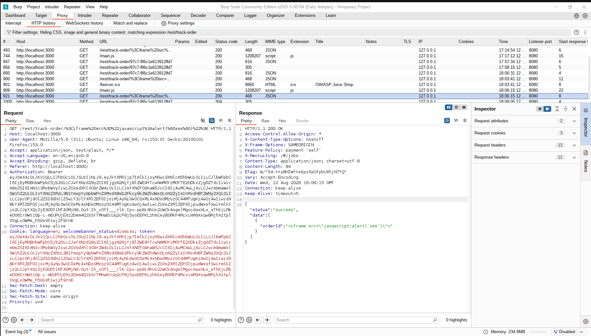
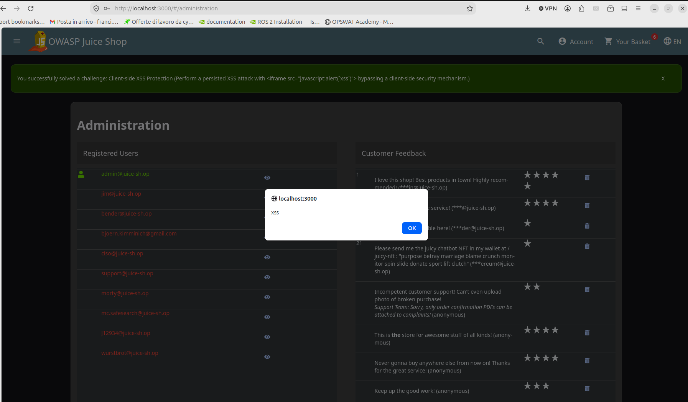
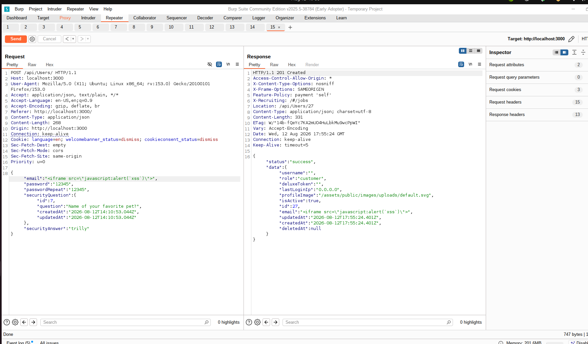
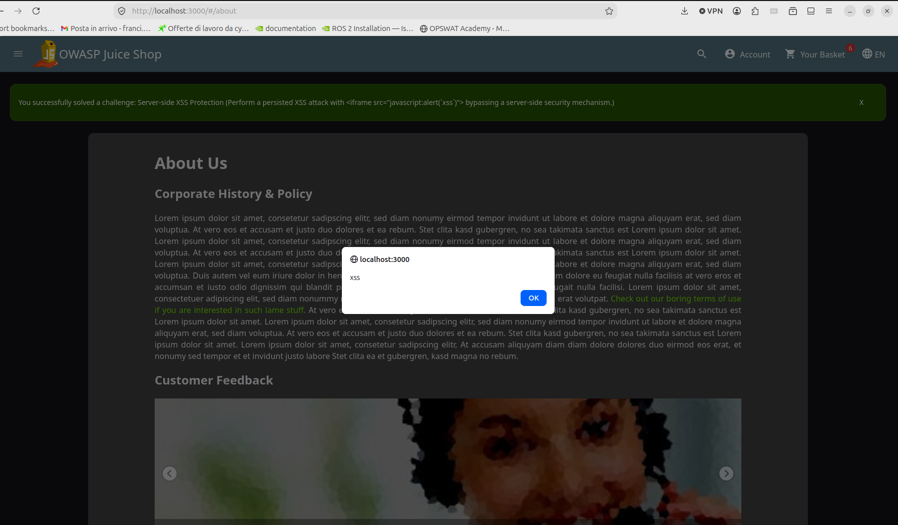
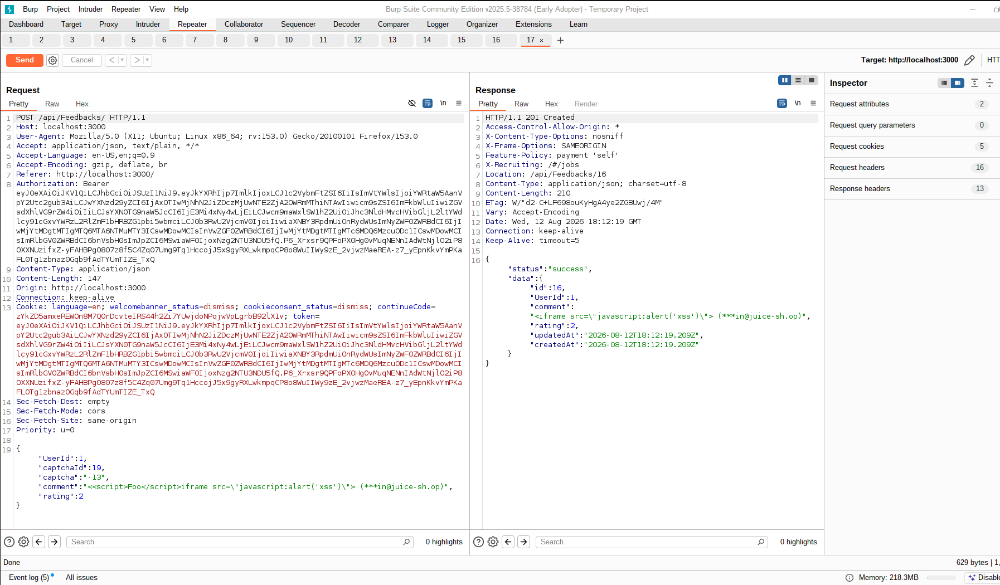

# XSS Lab Report — OWASP Juice Shop

**Course:** [505MI] Cybersecurity Lab A.Y. 2025/2026  
**Author:** Francesca Craievich  
**Target:** OWASP Juice Shop  
**Tools:** Burp Suite Community Edition, Firefox with proxy, Docker  

---

## 1. Introduction

Cross-Site Scripting (XSS) is a web vulnerability (CWE-79) that allows an attacker to inject malicious scripts into web pages viewed by other users. This report documents the exploitation of four XSS challenges on OWASP Juice Shop: **DOM-based XSS**, **Reflected XSS**, **Client-side XSS Protection**, and **Server-side XSS Protection**. The first two are non-persistent attacks that differ in how user input is processed; the latter two are persistent (stored) attacks that require bypassing sanitization mechanisms.

The Juice Shop instance was run in Docker with `NODE_ENV=unsafe` to enable all challenges:

```bash
docker run -e "NODE_ENV=unsafe" -p 3000:3000 bkimminich/juice-shop
```

Firefox was configured to proxy all traffic (including localhost) through Burp Suite on port 8080, with `network.proxy.allow_hijacking_localhost` set to `true` in `about:config`.

---

## 2. DOM-based XSS (Challenge 1)

### 2.1 Attack vector

The Juice Shop search functionality at `/#/search?q=...` reads the query parameter directly from the URL fragment and inserts it into the DOM without sanitization. Since the fragment (everything after `#`) is never sent to the server, the entire attack takes place client-side.

### 2.2 Exploitation

The following payload was entered in the search bar:

```
<iframe src="javascript:alert('xss')">
```

Resulting URL:

```
http://localhost:3000/#/search?q=<iframe src%3D"javascript:alert('xss')">
```

The browser parsed the `<iframe>` tag, executed the `javascript:` URI, and displayed an alert box containing "xss". The green banner confirmed the challenge was solved.



### 2.3 Analysis with Burp Suite

Juice Shop is a Single Page Application (SPA) built with Angular: all routing happens client-side via the URL fragment (`#/...`), without full page reloads. When the search is performed, Angular reads the `q` parameter directly from the fragment and renders it into the DOM using an unsafe method (such as `innerHTML`), without waiting for any server response. This is where the XSS executes.

A separate API call (`GET /rest/products/search?q=...`) is also made to fetch product results, and the payload does appear in that request. However, this is irrelevant to the XSS: the malicious code has already been parsed and executed by the browser during DOM rendering, independently of the API response (which simply returns `"data": []`).

This confirms the DOM-based nature of the vulnerability: the attack is entirely contained within the client-side code that reads the fragment and writes it into the DOM. The server never processes or reflects the payload in a way that contributes to the exploit.



---

## 3. Reflected XSS (Challenge 2)

### 3.1 Attack vector

The order tracking feature at `/#/track-result?id=...` sends the tracking ID to the server via the REST API endpoint `/rest/track-order/{id}`. The server includes the `id` parameter in its JSON response, and the client-side code renders this value into the page without sanitization.

### 3.2 Exploitation

The payload `<iframe src="javascript:alert('xss')">` was placed in the order tracking ID. In Juice Shop the route `/#/track-order` redirects to the homepage, so the direct URL format was used:

```
http://localhost:3000/#/track-result?id=<iframe src="javascript:alert('xss')">
```

The payload triggered an alert, confirming the vulnerability.



### 3.3 Analysis with Burp Suite

Unlike the DOM XSS, Burp Suite's HTTP history clearly shows the payload traveling to and from the server. The request:

```
GET /rest/track-order/%3Ciframe%20src%3D%22javascript:alert(%60xss%60)%22%3E HTTP/1.1
Host: localhost:3000
```

The server response (HTTP 200 OK) reflects the payload in the `orderId` field:

```json
{
  "status": "success",
  "data": [
    {
      "orderId": "<iframe src=\"javascript:alert('xss')\">"
    }
  ]
}
```

The server does not build a dynamic HTML page in the traditional reflected XSS sense. Instead, it returns a JSON response that includes the unsanitized tracking ID. The client-side Angular code then takes this `orderId` value and inserts it into the DOM without encoding, which causes the browser to parse and execute the injected `<iframe>`.



---

## 4. DOM vs. Reflected XSS: Key Differences

From the user's perspective, both challenges appear identical: an `<iframe>` payload triggers an `alert()`. However, the underlying mechanisms are fundamentally different.

In the **DOM XSS** challenge, the input never leaves the browser. The URL fragment (`#/search?q=PAYLOAD`) is read by client-side JavaScript, which extracts the value and writes it directly into the page's DOM. The server has no awareness of the payload. The vulnerability lies entirely in the client-side code that uses an unsafe DOM manipulation method.

In the **Reflected XSS** challenge, the input travels through the server. The tracking ID is sent as a path parameter in an API request (`/rest/track-order/PAYLOAD`). The server processes this input and includes it in its JSON response. The server still "reflects" the attacker-controlled string back to the client. The client-side code then renders this reflected value into the DOM unsafely. The vulnerability is a combination of server-side failure (not sanitizing the input in the response) and client-side failure (rendering the response without encoding).

---

## 5. Client-side XSS Protection (Extra Challenge 1)

This challenge requires a **Stored (Persistent) XSS** that bypasses client-side protection. Unlike the previous two challenges, a stored XSS payload is saved in the database and executes every time a user visits the affected page.

### 5.1 Attack vector

The registration endpoint (`POST /api/Users`) was chosen because the email field is one of the few user-controlled inputs that gets persisted in the database and later rendered in the UI. The Angular registration form at `/#/register` performs client-side validation (checking email format, required fields, etc.), but this validation only happens in the browser. The backend accepts and stores the email without any sanitization of its own.

### 5.2 Exploitation

By intercepting a legitimate registration request in Burp and sending it to Repeater, the email field was replaced with the XSS payload:

```json
{
  "email": "<iframe src=\"javascript:alert(`xss`)\">",
  "password": "12345",
  "passwordRepeat": "12345",
  "securityQuestion": { "id": 7 },
  "securityAnswer": "trilly"
}
```

The server returned **201 Created**, the payload was stored as the user's email in the database. To trigger the XSS, the administration panel at `/#/administration` was accessed by logging in as admin via SQL injection (`' OR 1=1--` as email, any password). The admin panel renders the list of registered users and the `<iframe>` was parsed and executed, triggering the alert.





---

## 6. Server-side XSS Protection (Extra Challenge 2)

This challenge is also a **Stored XSS**, but unlike the previous one, the server actively sanitizes input before storing it. Submitting a direct `<iframe src="javascript:alert('xss')">` payload in the Customer Feedback form (`/#/contact`) results in the comment being stripped entirely, the server returns `"comment":""`.

### 6.1 Identifying the sanitization library

To understand how the server sanitizes input, the application's dependency file was retrieved from the FTP endpoint. Accessing `/ftp/package.json.bak` directly returns a 403 error ("Only .md and .pdf files are allowed"):


A **Poison Null Byte** bypass was used:

```
http://localhost:3000/ftp/package.json.bak%2500.md
```

The `%2500` is a URL-encoded null byte: the file server checks the extension and sees `.md`, but the filesystem reads only up to the null byte and opens `package.json.bak`. Inside, the relevant dependency is:

```
"sanitize-html": "1.4.2"
```

The `sanitize-html` library works by parsing HTML input, identifying tags, and removing any that are not in a whitelist of allowed tags (by default only basic formatting like `<b>`, `<i>`, `<p>` is permitted). Tags like `<iframe>`, `<script>`, and `` are stripped entirely, along with their attributes.

### 6.2 Exploitation

Version 1.4.2 of `sanitize-html` has a known vulnerability in how it processes nested tags. The sanitizer makes a single pass over the input: it identifies and removes disallowed tags, but does not re-parse the result. This allows a bypass by nesting a tag inside another tag's opening bracket:

```
<<script>Foo</script>iframe src="javascript:alert(`xss`)">
```

The sanitizer sees `<script>Foo</script>` as a disallowed tag and removes it. What remains is the outer `<` concatenated with `iframe src="javascript:alert(`xss`)">`, which reassembles into a valid `<iframe>` tag:

```
<iframe src="javascript:alert(`xss`)">
```

This payload was sent via Burp Intercept by modifying the `comment` field in the Customer Feedback POST request to `/api/Feedbacks/`. The server sanitized the input but the bypass survived, and the payload was stored in the database. Visiting `/#/about`, which displays a customer feedback, triggered the alert.





---

## 7. Client-side vs. Server-side Protection

Both extra challenges are Stored XSS, but the protection that must be bypassed is located at a different layer:

In the **Client-side XSS Protection** challenge, the defense exists only in the browser. The Angular registration form validates the email format and prevents submitting malicious input through the UI. However, the server performs no validation of its own, it stores whatever it receives. The bypass is straightforward: send the request directly via Burp, skipping the form entirely.

In the **Server-side XSS Protection** challenge, the defense exists on the server. Even when submitting via Burp (bypassing the browser), the server runs `sanitize-html` 1.4.2 on the input and strips HTML tags before storing. The bypass requires exploiting a vulnerability in the sanitization library itself, the nested tag technique that tricks the parser into leaving a valid `<iframe>` after processing.


---

## 8. Conclusions

The four challenges demonstrate the full spectrum of XSS vulnerabilities. DOM and Reflected XSS are non-persistent and differ in whether the payload passes through the server. Client-side and Server-side XSS Protection are both Stored XSS that persist in the database, but differ in where the protection is applied and how it must be bypassed. Together, they show that XSS defense must operate at every layer of the application.
