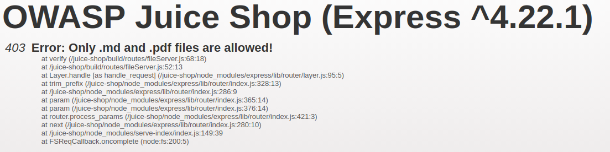

# XSS Extra Challenges - OWASP Juice Shop

**Course:** [505MI] Cybersecurity Lab A.Y. 2025/2026  
**Author:** Francesca Craievich  
**Target:** OWASP Juice Shop  
**Tools:** Burp Suite Community Edition, Firefox with proxy, Docker  

---

## 1. Introduction

This report documents two additional XSS challenges on OWASP Juice Shop, both involving **Stored (Persistent) XSS**. Unlike the DOM and Reflected XSS covered in the main lab report (`04_XSS`), stored XSS payloads are saved in the database and execute every time a user visits the affected page. The two challenges differ in where the protection is applied: **Client-side XSS Protection** relies on browser-side validation, while **Server-side XSS Protection** uses a server-side sanitization library.

The Juice Shop instance was run in Docker with `NODE_ENV=unsafe` to enable all challenges:

```bash
docker run -e "NODE_ENV=unsafe" -p 3000:3000 bkimminich/juice-shop
```

Firefox was configured to proxy all traffic (including localhost) through Burp Suite on port 8080, with `network.proxy.allow_hijacking_localhost` set to `true` in `about:config`.

---

## 2. Client-side XSS Protection

This challenge requires a **Stored (Persistent) XSS** that bypasses client-side protection. Unlike the previous two challenges, a stored XSS payload is saved in the database and executes every time a user visits the affected page.

### 2.1 Attack vector

The registration endpoint (`POST /api/Users`) was chosen because the email field is one of the few user-controlled inputs that gets persisted in the database and later rendered in the UI. The Angular registration form at `/#/register` performs client-side validation (checking email format, required fields, etc.), but this validation only happens in the browser. The backend accepts and stores the email without any sanitization of its own.

### 2.2 Exploitation

By intercepting a legitimate registration request in Burp and sending it to Repeater, the email field was replaced with the XSS payload:

```json
{
  "email": "<iframe src=\"javascript:alert(`xss`)\">",
  "password": "12345",
  "passwordRepeat": "12345",
  "securityQuestion": { "id": 7 },
  "securityAnswer": "trilly"
}
```

The server returned **201 Created**, the payload was stored as the user's email in the database. To trigger the XSS, the administration panel at `/#/administration` was accessed by logging in as admin via SQL injection (`' OR 1=1--` as email, any password). The admin panel renders the list of registered users and the `<iframe>` was parsed and executed, triggering the alert.


---

## 3. Server-side XSS Protection

This challenge is also a **Stored XSS**, but unlike the previous one, the server actively sanitizes input before storing it. Submitting a direct `<iframe src="javascript:alert('xss')">` payload in the Customer Feedback form (`/#/contact`) results in the comment being stripped entirely, the server returns `"comment":""`.

### 3.1 Identifying the sanitization library

To understand how the server sanitizes input, the application's dependency file was retrieved from the FTP endpoint. Accessing `/ftp/package.json.bak` directly returns a 403 error ("Only .md and .pdf files are allowed"):



A **Poison Null Byte** bypass was used:

```
http://localhost:3000/ftp/package.json.bak%2500.md
```

The `%2500` is a URL-encoded null byte: the file server checks the extension and sees `.md`, but the filesystem reads only up to the null byte and opens `package.json.bak`. Inside, the relevant dependency is:

```
"sanitize-html": "1.4.2"
```

The `sanitize-html` library works by parsing HTML input, identifying tags, and removing any that are not in a whitelist of allowed tags (by default only basic formatting like `<b>`, `<i>`, `<p>` is permitted). Tags like `<iframe>`, `<script>`, and `` are stripped entirely, along with their attributes.

### 3.2 Exploitation

Version 1.4.2 of `sanitize-html` has a known vulnerability in how it processes nested tags. The sanitizer makes a single pass over the input: it identifies and removes disallowed tags, but does not re-parse the result. This allows a bypass by nesting a tag inside another tag's opening bracket:

```
<<script>Foo</script>iframe src="javascript:alert(`xss`)">
```

The sanitizer sees `<script>Foo</script>` as a disallowed tag and removes it. What remains is the outer `<` concatenated with `iframe src="javascript:alert(`xss`)">`, which reassembles into a valid `<iframe>` tag:

```
<iframe src="javascript:alert(`xss`)">
```

This payload was sent via Burp Intercept by modifying the `comment` field in the Customer Feedback POST request to `/api/Feedbacks/`. The server sanitized the input but the bypass survived, and the payload was stored in the database. Visiting `/#/about`, which displays a customer feedback, triggered the alert.


---

## 4. Client-side vs. Server-side Protection

Both challenges are Stored XSS, but the protection that must be bypassed is located at a different layer:

In the **Client-side XSS Protection** challenge, the defense exists only in the browser. The Angular registration form validates the email format and prevents submitting malicious input through the UI. However, the server performs no validation of its own, it stores whatever it receives. The bypass is straightforward: send the request directly via Burp, skipping the form entirely.

In the **Server-side XSS Protection** challenge, the defense exists on the server. Even when submitting via Burp (bypassing the browser), the server runs `sanitize-html` 1.4.2 on the input and strips HTML tags before storing. The bypass requires exploiting a vulnerability in the sanitization library itself, the nested tag technique that tricks the parser into leaving a valid `<iframe>` after processing.

---

## 5. Conclusions

These two additional challenges complete the XSS spectrum explored in the main lab. While the main report covers non-persistent attacks (DOM and Reflected XSS), these stored XSS challenges demonstrate how payloads persisted in the database can affect every visitor of the compromised page. The key takeaway is that XSS defense must operate at every layer: client-side validation alone is trivially bypassed, and even server-side sanitization can fail if the library has known vulnerabilities or uses single-pass parsing.

---

> **Disclosure:** An LLM (Claude) was used to assist with the organization and formatting of this report.
