# SQL Injection Lab Report — OWASP Juice Shop

**Course:** [505MI] Cybersecurity Lab A.Y. 2025/2026  
**Author:** Francesca Craievich  
**Target:** OWASP Juice Shop  
**Tools:** Burp Suite Community Edition, Firefox with proxy, Docker  

---

## 1. Introduction

SQL Injection (CWE-89) occurs when user-supplied input is incorporated into SQL queries without proper sanitization, allowing an attacker to alter the query's logic. SQLi attacks are classified by how the attacker receives feedback: **in-band** (query results are visible in the HTTP response), **blind** (only indirect feedback such as boolean outcomes, error messages, or time delays), and **out-of-band** (data exfiltration via a separate channel like DNS). This report documents the exploitation of two SQLi challenges on OWASP Juice Shop: **Login Bender** (authentication bypass) and **Database Schema** (data extraction), covering one challenge per category as required.

The Juice Shop instance  was run locally via Docker:

```bash
docker run --rm -p 3000:3000 bkimminich/juice-shop
```

Firefox was configured to proxy all traffic through Burp Suite on port 8080.

---

## 2. Authentication Bypass - Login Bender

**Challenge:** *Log in with Bender's user account.*

**Vulnerable endpoint:** `POST /rest/user/login`

### 2.1 Reconnaissance

Before attempting injection, information gathering was necessary. The About page (`/#/about`) displays customer feedback entries that include email addresses. Browsing the page revealed Bender's email: `bender@juice-sh.op`.

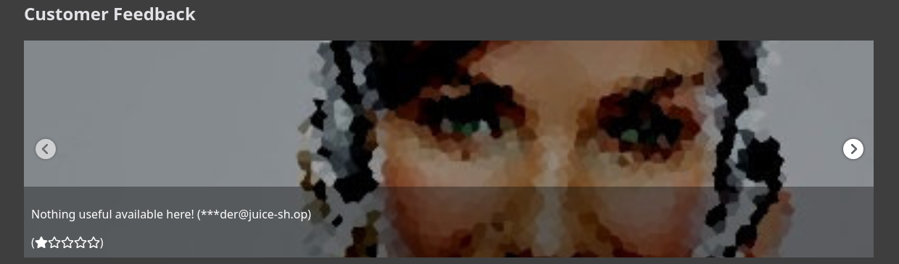

### 2.2 Assumptions

The login form sends `email` and `password` to a backend that likely constructs a query similar to:

```sql
SELECT * FROM Users WHERE email='$email' AND password='$password'
```

If the input is not sanitized, injecting a single quote can break the query syntax. 

### 2.3 Exploitation

1. Navigate to `http://localhost:3000/#/login`.
2. In the **Email** field, enter: `bender@juice-sh.op'--`
3. In the **Password** field, enter any value.
4. Click **Log in**.

The resulting SQL query becomes:

```sql
SELECT * FROM Users WHERE email='bender@juice-sh.op'--' AND password='anything'
```

Everything after `--` is treated as a SQL comment. The query now only checks the email, bypassing password verification entirely. This technique works for any user whose email is known, making it more dangerous than a simple tautology because it allows **targeted account takeover**.


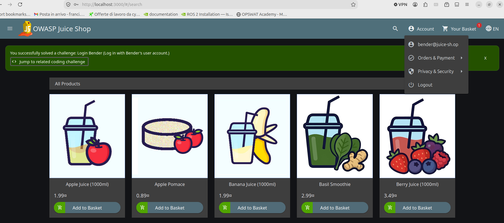

### 2.4 Analysis with Burp Suite

Burp Suite's HTTP history shows the POST request to `/rest/user/login` with the payload in the JSON body:

```json
{
  "email": "bender@juice-sh.op'--",
  "password": "1"
}
```

The server responds with `200 OK` and a valid authentication token with `"umail":"bender@juice-sh.op"`, confirming that the password was never checked.

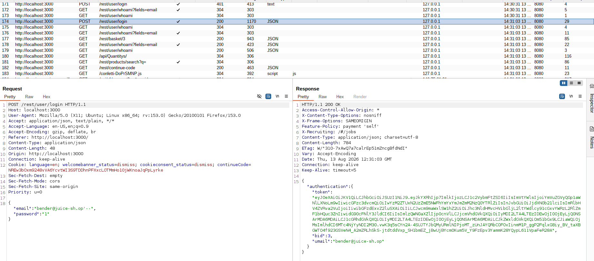

### 2.5 Vulnerable code and fix

The vulnerability was also analyzed through Juice Shop's "Find It / Fix It" coding challenge. The `login()` function constructs the query using string interpolation:

```javascript
models.sequelize.query(
  `SELECT * FROM Users WHERE email = '${req.body.email || ''}' AND password = '${security.hash(req.body.password || '')}'...`
);
```

The fix replaces interpolation with Sequelize's bind parameter mechanism, equivalent to a prepared statement,`$mail` and `$pass` are never interpreted as SQL code:

```javascript
models.sequelize.query(
  'SELECT * FROM Users WHERE email = $mail AND password = $pass AND deletedAt IS NULL',
  { bind: { mail: req.body.email, pass: security.hash(req.body.password) },
    model: models.User, plain: true }
)
```

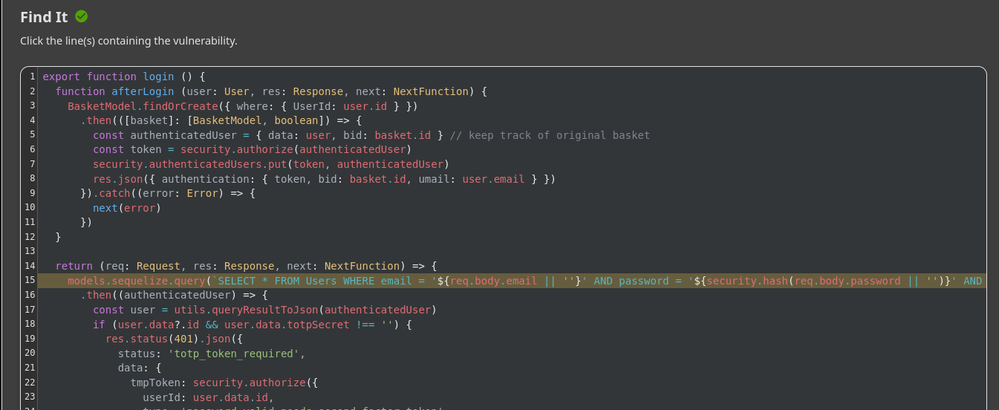

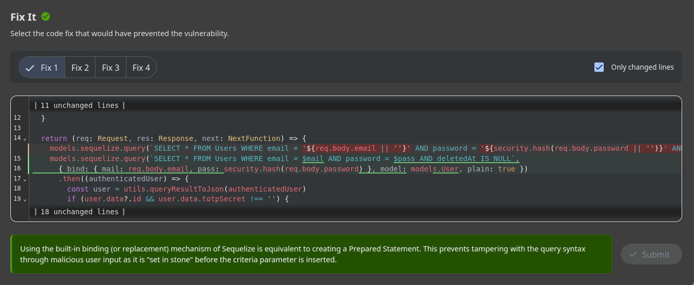

---

## 3. Data Extraction - Database Schema

**Challenge:** *Exfiltrate the entire DB schema definition via SQL Injection.*

**Vulnerable endpoint:** `GET /rest/products/search?q=`

### 3.1 Reconnaissance

The product search endpoint constructs a query like:

```sql
SELECT * FROM Products WHERE ((name LIKE '%$q%' OR description LIKE '%$q%') AND deletedAt IS NULL) ORDER BY name
```

The vulnerability was confirmed by injecting a single quote (`'`), which returned a `SQLITE_ERROR` revealing both the vulnerability and the database type (SQLite).

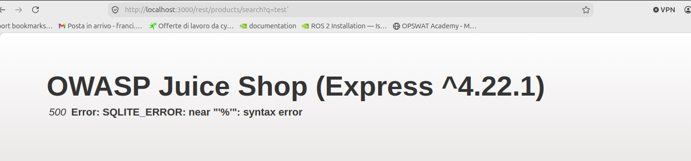

### 3.2 Exploitation

**Step 1 - Close the query syntax.** The query wraps its conditions in double parentheses: `((name LIKE '...' OR description LIKE '...') AND deletedAt IS NULL)`. After breaking out of the string with `'`, the injection is still inside two levels of `(`. The payload `test'))--` closes both parentheses and comments out the rest, producing valid SQL that returns an empty but successful response.

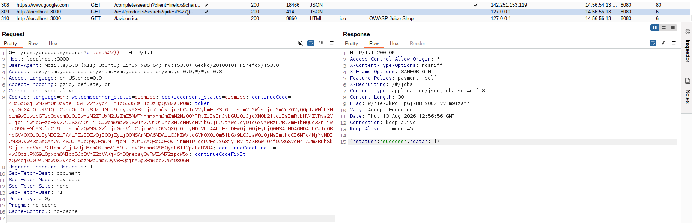

**Step 2 - Find the column count.** A `UNION SELECT` requires matching the number of columns. Testing with incrementing values: `test')) UNION SELECT 1,2,3,4,5,6,7,8,9--` succeeded, confirming **9 columns**.

**Step 3 - Identify the system catalog.** Since the database is SQLite, the system table is `sqlite_master`, which stores `CREATE TABLE` statements in a column named `sql`.

**Step 4 — Extract the schema:**

```
http://localhost:3000/rest/products/search?q=test')) UNION SELECT sql,'2','3','4','5','6','7','8','9' FROM sqlite_master--
```

The JSON response contained the `CREATE TABLE` statements for every table, including `Users`, `Products`, `BasketItems`, `Addresses`, and others.

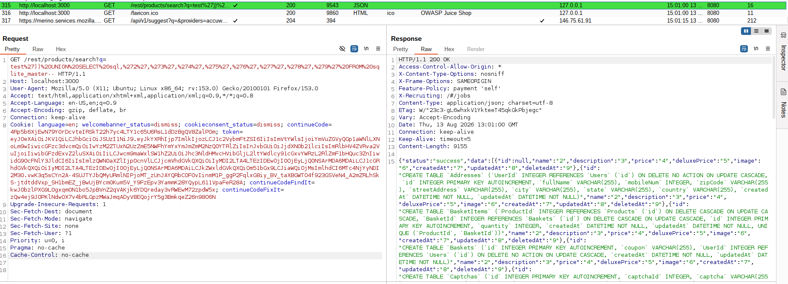

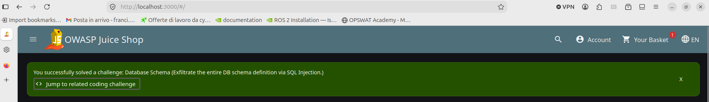


### 3.3 Vulnerable code and fix

The `searchProducts()` function has the vulnerability:

```javascript
models.sequelize.query(
  `SELECT * FROM Products WHERE ((name LIKE '%${criteria}%' ...`
);
```

The fix uses Sequelize's replacement mechanism, equivalent to a prepared statement. Even SQL syntax like `' UNION SELECT` is treated as a string, never as code:

```javascript
models.sequelize.query(
  `SELECT * FROM Products WHERE ((name LIKE '%:criteria%' ...`,
  { replacements: { criteria } }
);
```

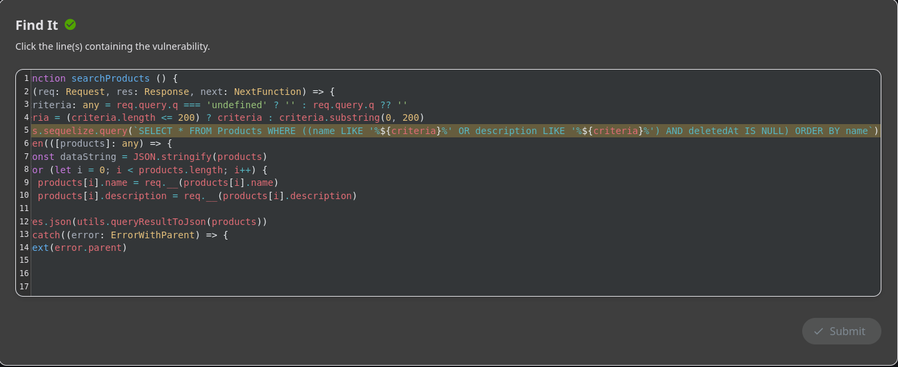

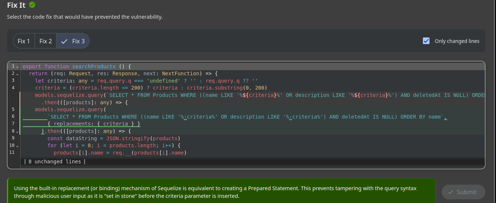

---

## 4. Discussion on Root Causes and Takeaways

Both challenges share the same root cause: **string interpolation** in SQL query construction. The `login()` and `searchProducts()` functions directly embed user input into SQL strings using JavaScript template literals, allowing the attacker to break out of the intended string context and inject arbitrary SQL.

The fix in both cases is the same: **prepared statements**. By separating the query structure from the data, user input is always treated as a literal value, never as executable code. This is the most effective defense against SQL injection because it eliminates the vulnerability at its source, regardless of what the attacker submits.

Additional defense-in-depth measures include: applying the principle of least privilege to database accounts, implementing input validation (whitelists over blacklists), and avoiding verbose error messages that leak information about the database structure (as seen in the `SQLITE_ERROR` that revealed the database type).

---

> **Disclosure:** An LLM (Claude) was used to assist with the organization and formatting of this report.
