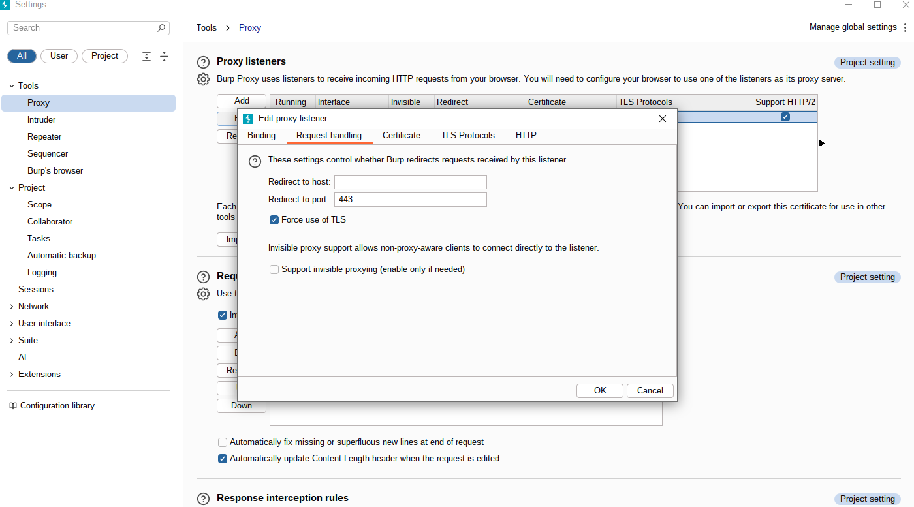
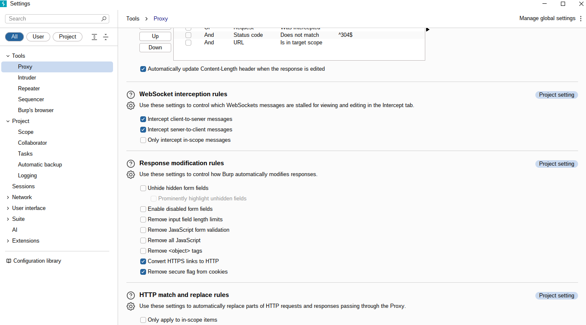
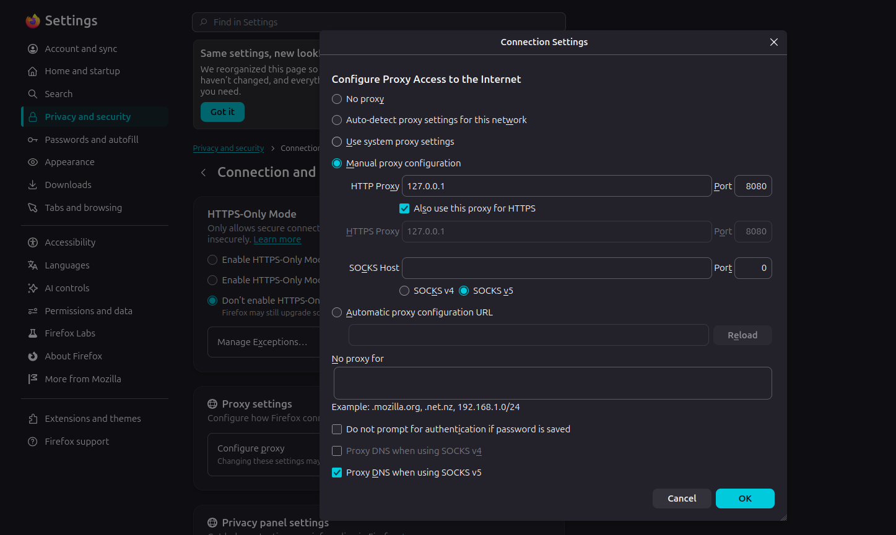
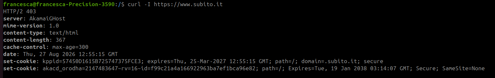
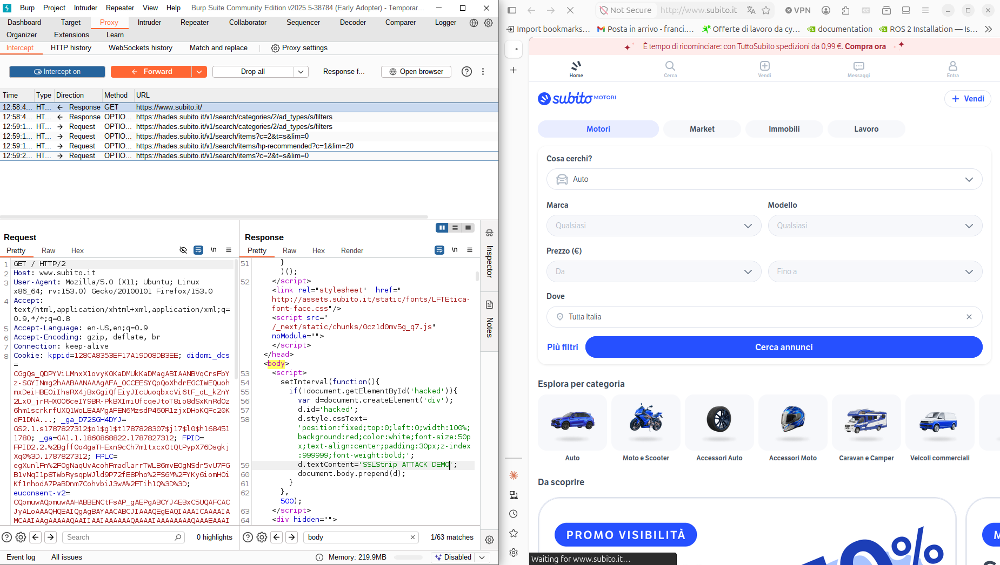
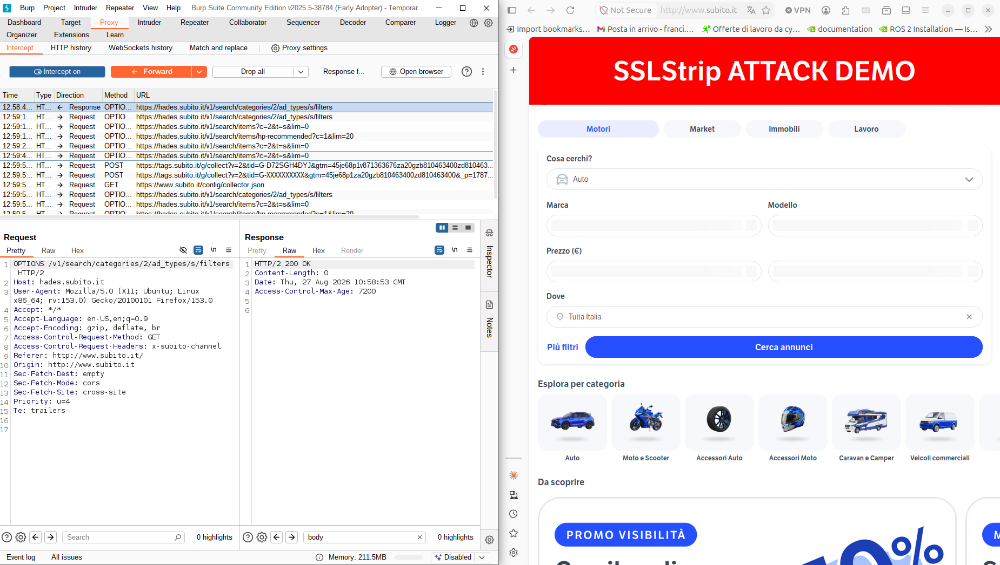
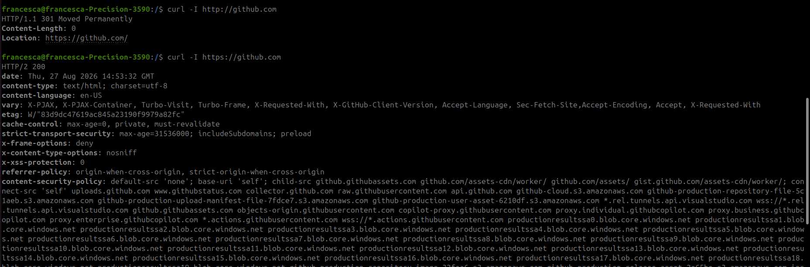
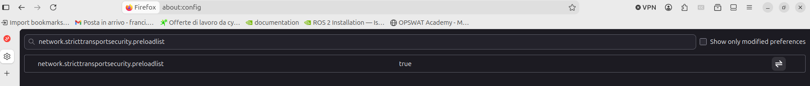
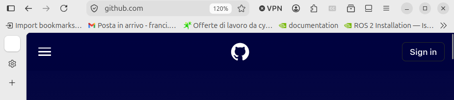
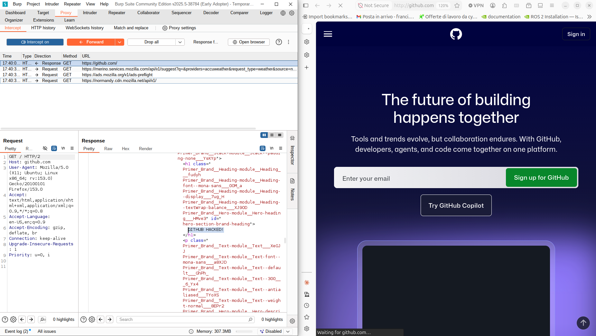

# Lab 06 - Adversary-in-the-Middle: SSLStrip with BURP Proxy

**Course:** [505MI] Cybersecurity Lab A.Y. 2025/2026  
**Author:** Francesca Craievich  
**Tools:** Burp Suite Community Edition, Firefox with proxy

---

## 1. Introduction

This report documents the SSLStrip attack performed using BURP Suite Community Edition (v2025.5) as an AiTM proxy. The attack exploits the HTTP-to-HTTPS upgrade mechanism: a proxy positioned between the client and server intercepts HTTP traffic, upgrades it to HTTPS toward the server, and serves the downgraded HTTP content back to the client. The client never establishes a direct HTTPS connection, enabling the attacker to read and modify all traffic in transit.

Two cases were analyzed:

- **Case A:** A website without effective HSTS protection (subito.it), demonstrating a successful SSLStrip attack with content modification.
- **Case B:** A website with HSTS and preload protection (github.com), demonstrating how HSTS prevents the attack and how the vulnerability window exposes the site when HSTS is absent.

**Tools used:**
- BURP Suite Community Edition v2025.5 (build 38784)
- Mozilla Firefox 153.0.1 (Ubuntu/Linux)

**HSTS Class Survey:** [Link to Google Spreadsheet](https://docs.google.com/spreadsheets/d/1t-G4sqvYH0eFBh1VvDVtpJ6LX-Mc3ilK8K2TPuCwSsA/edit?gid=32093958#gid=32093958)

---

## 2. BURP Configuration for SSLStrip

Three configuration steps are needed to turn BURP Proxy into an SSLStrip proxy. These differ from the normal BURP usage where the proxy simply relays traffic for inspection.

### 2.1 Force Use of TLS (Request Handling)

In **Proxy > Proxy listeners**, edit the listener on `127.0.0.1:8080` and navigate to the **Request Handling** tab. Enable **"Force use of TLS"**. This forces BURP to upgrade every outgoing request to HTTPS, regardless of the protocol used by the client. In normal BURP usage, TLS is not forced, the proxy preserves the original protocol.



### 2.2 Convert HTTPS Links to HTTP (Response Modification)

In **Settings > Tools > Proxy**, scroll to the **Response Modification** section and enable **"Convert HTTPS links to HTTP"**. This rewrites all `https://` links in server responses to `http://`, ensuring the client continues navigating over unencrypted HTTP. In normal BURP usage, response content is not modified.



### 2.3 Enable Response Interception

In **Settings > Tools > Proxy**, enable **"Intercept responses based on the following rules"**. This allows the attacker to view and modify server responses before they reach the client. The rule "And - URL - Is in target scope" should be disabled unless the target site has been explicitly added to the scope, otherwise responses will be filtered out.

In normal BURP usage, only requests are typically intercepted, not responses.

### 2.4 Firefox Proxy Configuration

Firefox was configured to use BURP as its proxy via **Settings > Network Settings > Manual proxy configuration**, with HTTP Proxy set to `127.0.0.1` port `8080` and "Also use this proxy for HTTPS" enabled.



---

## 3. Case A: Website Without Effective HSTS (subito.it)

### 3.1 Target Selection

The target was selected by verifying the absence of HSTS headers using `curl`:



The HTTP response (403 from Akamai CDN) did not include a `Strict-Transport-Security` header, making it a candidate for the SSLStrip attack.


### 3.2 Attack Execution

With BURP configured for SSLStrip, navigating to `http://www.subito.it` in Firefox resulted in:

- The browser displayed `http://www.subito.it` in the address bar with a **"Not Secure"** warning
- All links in the HTML response were converted from `https://` to `http://` by BURP
- The page loaded normally over HTTP, with BURP silently handling the HTTPS connection to the server



### 3.3 Content Modification via JavaScript Injection

To demonstrate the full impact of the attack, a content modification was performed on the intercepted response. Subito.it is built with **Next.js**, a React-based framework that performs client-side hydration, the JavaScript framework reconstructs the entire DOM after the initial HTML loads, overwriting any static HTML modifications.

To overcome this, a persistent JavaScript payload was injected after the `<body>` tag in the intercepted response:

```html
<script>
setInterval(function(){
  if(!document.getElementById('hacked')){
    var d=document.createElement('div');
    d.id='hacked';
    d.style.cssText='position:fixed;top:0;left:0;width:100%;background:red;color:white;font-size:50px;text-align:center;padding:30px;z-index:999999;font-weight:bold;';
    d.textContent='SSLStrip ATTACK DEMO';
    document.body.prepend(d);
  }
},500);
</script>
```

This script uses `setInterval` to re-inject a banner element every 500ms, surviving the framework's hydration cycle. The result was a persistent red banner reading "SSLStrip ATTACK DEMO" displayed on top of the page.




---

## 4. Case B: Website With HSTS and Preload (github.com)

### 4.1 Target Verification

GitHub's HSTS configuration was verified via `curl`:

```
$ curl -I https://github.com 
strict-transport-security: max-age=31536000; includeSubdomains; preload <---
```


The `preload` directive indicates that the site owner has opted into HSTS preloading. Actual inclusion in the browser's built-in preload list was confirmed at [hstspreload.org](https://hstspreload.org), which reports: "github.com is currently preloaded".

In Firefox, the HSTS preload list status is controlled by the `about:config` preference `network.stricttransportsecurity.preloadlist` (default: `true`). Unlike Chrome's `chrome://net-internals/#hsts`, Firefox does not provide a dedicated UI for querying individual HSTS entries.



### 4.2 Experiment 1: HSTS Active (Attack Fails)

With `network.stricttransportsecurity.preloadlist` set to `true` (default), navigating to `http://github.com` resulted in:

- Firefox automatically upgraded the connection to `https://github.com`
- The address bar showed `https://` with a valid certificate (lock icon)
- **The SSLStrip attack was completely blocked** - browser ignored the Burp proxy's attempt to keep the connection on HTTP and immediately forced an internal redirect to HTTPS.




This confirms that HSTS prevents SSLStrip by instructing the browser to connect exclusively over HTTPS, regardless of the protocol specified in the URL or any link.

### 4.3 Experiment 2: HSTS Disabled — Vulnerability Window (Attack Succeeds)

To simulate the HSTS vulnerability window (a user who has never visited the site, or whose HSTS policy has expired), the following steps were taken:

1. In `about:config`, set `network.stricttransportsecurity.preloadlist` to `false`
2. Cleared cached data 

Navigating to `http://github.com` now resulted in:

- The browser displayed `http://github.com` with a **"Not Secure"** warning
- The SSLStrip attack succeeded — the page was loaded over HTTP
- Content modification was performed: the page title was changed to **"GITHUB HACKED!"**, demonstrating full control over the response content




---

## 5. Differences from Normal BURP Proxy Usage

| Aspect | Normal BURP Usage | SSLStrip Configuration |
|--------|-------------------|----------------------|
| TLS handling | Preserves original protocol | Forces TLS on all outgoing requests |
| Response content | Unmodified | HTTPS links rewritten to HTTP |
| Response interception | Typically disabled | Enabled to allow content modification |
| Client connection | HTTPS with BURP CA certificate | HTTP only  |
| Purpose | Traffic inspection and testing | Protocol downgrade |


## 6. Conclusions

The SSLStrip attack demonstrates a fundamental weakness in the HTTP-to-HTTPS upgrade model: if the initial connection is over HTTP, an attacker positioned between client and server can prevent the upgrade entirely. The experiments confirm that:

- **Without HSTS**, the attack succeeds completely, allowing the attacker to intercept, read, and modify all traffic, including injecting arbitrary JavaScript for credential theft or session hijacking.
- **With HSTS active** (especially preloaded), the browser refuses to connect over HTTP, making SSLStrip ineffective.
- **The vulnerability window** (before first visit or after policy expiration) remains a real attack surface for sites relying solely on dynamic HSTS without preloading.
- **Modern browsers** are increasingly mitigating this attack through multiple defense layers (HSTS, HTTPS-First mode, DNS HTTPS records), making SSLStrip progressively less viable in practice.
