# Lab 06 - Adversary-in-the-Middle: ARP Cache Poisoning

**Course:** [505MI] Cybersecurity Lab A.Y. 2025/2026  
**Author:** Francesca Craievich  
**Tools:** Scapy (Python 3), Docker (SEED Labs), Wireshark/tcpdump

---

## 1. Introduction

This report documents the ARP Cache Poisoning lab from the SEED Labs project. ARP (Address Resolution Protocol) is a stateless protocol that maps IP addresses to MAC addresses on a local network. Because ARP has no authentication mechanism, any host on the LAN can send spoofed ARP packets to associate its own MAC address with another host's IP, redirecting traffic through itself. 

The lab is divided into three tasks. Task 1 explores three different methods to inject a forged ARP mapping into a victim's cache using Scapy: ARP Request, ARP Reply, and Gratuitous ARP. Task 2 uses bidirectional ARP poisoning to perform a man-in-the-middle attack on a Telnet session, replacing every typed character with the letter "Z". Task 3 applies the same technique to a Netcat session, selectively replacing the name "Francesca" with "AAAAAAAAA" (same length, 9 characters).

**Environment:** SEED Labs Docker containers running on Ubuntu (kernel 6.17.0-40-generic) instead of the SEED VM. Three containers on the `10.9.0.0/24` network:

| Host | IP | MAC |
|---|---|---|
| A (victim) | 10.9.0.5 | `c2:50:dd:3d:6e:a4` |
| B (victim) | 10.9.0.6 | `3a:59:4c:10:29:58` |
| M (attacker) | 10.9.0.105 | `c2:79:7a:52:23:9a` |

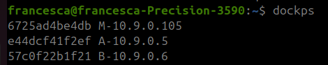

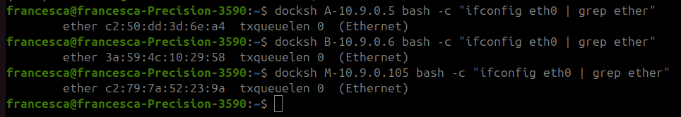

The containers were started with `dcup` and accessed via the `docksh`. MAC addresses were retrieved by running `ifconfig eth0 | grep ether` inside each container.

---

## 2. Task 1: ARP Cache Poisoning

The goal of Task 1 is to poison Host A's ARP cache so that the entry for Host B's IP (`10.9.0.6`) maps to the attacker M's MAC address (`c2:79:7a:52:23:9a`). Three ARP packet types were tested, each evaluated under two conditions: when A's cache already contains a legitimate entry for B (populated via `ping`), and when A's cache is empty (cleared via `arp -d`).

### 2.1 Task 1A: ARP Request

An ARP Request (opcode 1) is broadcast on the network. The spoofed request claims to originate from B's IP (`10.9.0.6`) but carries M's MAC address as the source hardware address. When A receives this broadcast, it reads the sender's IP-to-MAC mapping and updates its cache accordingly.

**Script (`task1a.py`):**

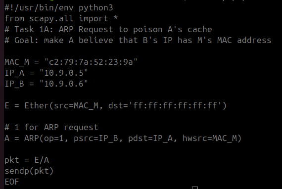

**Execution:** The script was run from M (`python3 /volumes/task1a.py`), sending one spoofed ARP Request.

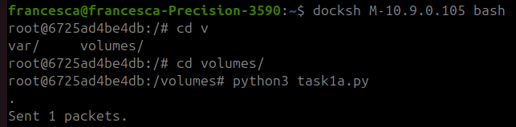

**Result:** A's ARP cache now maps `10.9.0.6` to `c2:79:7a:52:23:9a` (M's MAC instead of B's real MAC).

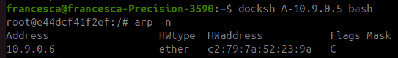

The ARP Request succeeded in poisoning A's cache. The broadcast request is processed by A, which extracts the sender's IP-MAC mapping and stores it.

### 2.2 Task 1B: ARP Reply

An ARP Reply (opcode 2) is sent unicast directly to A. The spoofed reply claims that B's IP (`10.9.0.6`) is associated with M's MAC address.

**Script (`task1b.py`):**

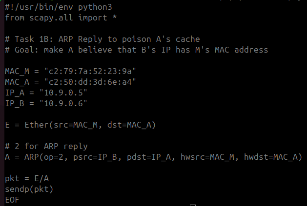

**Test 1 - Cache empty:** A's cache was cleared with `arp -d 10.9.0.6`. After running the attack script from M, A's cache remained empty. The unsolicited ARP Reply did not create a new entry.

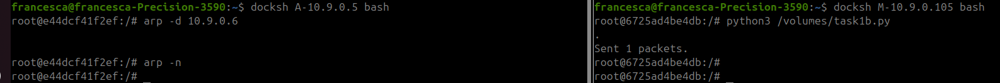

**Observation:** The ARP Reply only works when A's cache already has an entry for B. An unsolicited reply to an empty cache is ignored by the kernel, which only updates existing mappings from replies.

**Test 2 - Cache populated:** A first pinged B to populate the cache with B's real MAC (`3a:59:4c:10:29:58`). After running the attack script from M, A's cache was checked again: `10.9.0.6` now mapped to `c2:79:7a:52:23:9a` (M's MAC). The ARP Reply successfully overwrote the legitimate entry.

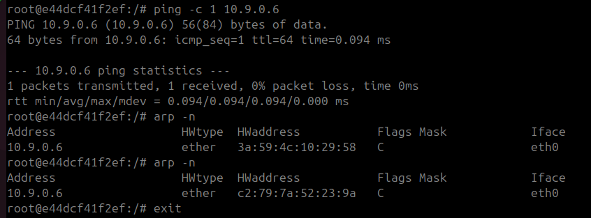

### 2.3 Task 1C: Gratuitous ARP

A Gratuitous ARP is a special ARP Request where the sender IP equals the target IP (`psrc == pdst`). It is normally used by a host to announce its own IP-MAC binding (e.g. after booting or changing MAC). The spoofed version claims that B's IP (`10.9.0.6`) is associated with M's MAC, broadcast to all hosts.

**Script (`task1c.py`):**

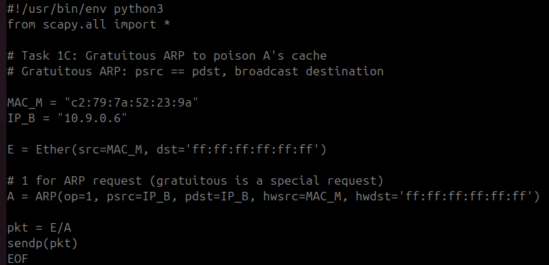

**Test 1 - Cache empty:** A's cache was cleared with `arp -d 10.9.0.6`. After M sent the Gratuitous ARP, A's cache remained empty. The Gratuitous ARP did not create a new entry.

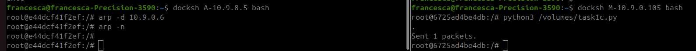

**Observation:** Like the ARP Reply, the Gratuitous ARP only updates existing cache entries and does not create new ones when the cache is empty.

**Test 2 - Cache populated:** A pinged B first, populating the cache with B's real MAC. After M sent the Gratuitous ARP, A's cache was updated to map `10.9.0.6` to `c2:79:7a:52:23:9a` (M's MAC). The attack succeeded.

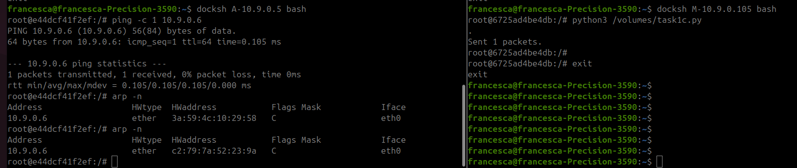

### 2.4 Task 1 Summary

| Method | Cache populated | Cache empty |
|---|---|---|
| 1A - ARP Request (broadcast) | Poisoned | Poisoned |
| 1B - ARP Reply (unicast) | Poisoned | No effect |
| 1C - Gratuitous ARP (broadcast) | Poisoned | No effect |

The ARP Request is the most effective method: it poisons the cache regardless of its initial state. The ARP Reply and Gratuitous ARP can only overwrite existing entries.

---

## 3. Task 2: MITM Attack on Telnet (ARP Poisoning)

The goal of Task 2 is to perform a full man-in-the-middle attack on a Telnet session between A and B. This requires three components running simultaneously on M: (1) a bidirectional ARP poisoning script, (2) kernel-level IP forwarding control, and (3) a sniff-and-spoof script that intercepts and modifies traffic in real time.

### 3.1 Step 1: Bidirectional ARP Poisoning

To intercept traffic in both directions, M must poison both A's and B's caches simultaneously. The script sends continuous ARP Requests: one tells A that B's IP has M's MAC, and the other tells B that A's IP has M's MAC.

**Script (`task2_poison.py`):**

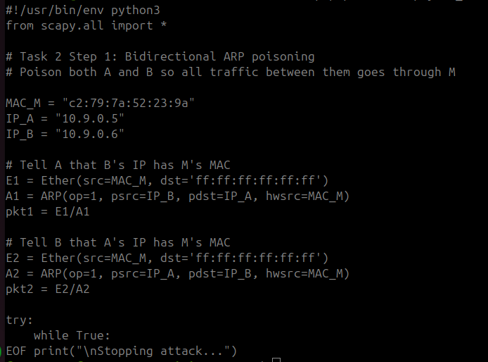

### 3.2 Step 2: Verify Poisoning with IP Forwarding Off

With `ip_forward=0` on M, poisoned traffic from A to B is dropped at M since M does not forward it. This was verified by checking A's cache (which showed M's MAC for B's IP) and pinging B from A: 100% packet loss confirmed the poisoning was effective and M was intercepting all traffic.

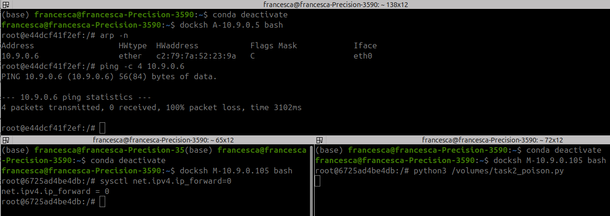

### 3.3 Step 3: Enable Forwarding and Fix ICMP Redirects

Setting ip_forward=1 on M allows it to forward packets between A and B, restoring connectivity while keeping M in the middle.
 However, on kernel 6.17, a problem arose: since A, M, and B are all on the same subnet (10.9.0.0/24), when M's kernel forwards a packet from A to B, it detects that the source and destination are on the same network interface. The kernel concludes that A should be able to reach B directly without going through M, and sends an ICMP Redirect message back to A. Upon receiving this redirect, A's kernel triggers a fresh ARP resolution for 10.9.0.6, and B responds with its real MAC address (3a:59:4c:10:29:58), effectively undoing the ARP poisoning. A then sends packets directly to B, bypassing M. Meanwhile, the poisoning script re-poisons A's cache, M sends another redirect, A resolves B's real MAC again creating an oscillation that causes packet loss. 
 This was fixed by disabling ICMP redirects on M with sysctl on both eth0 and all interfaces (send_redirects=0).

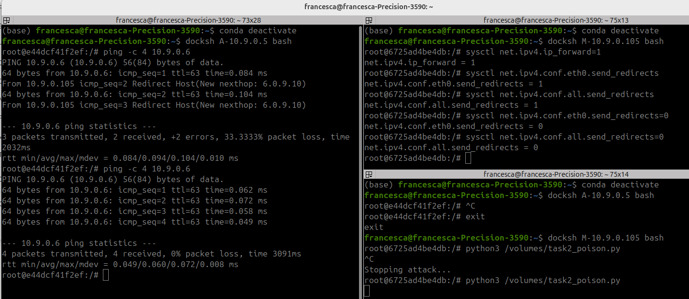

### 3.4 Step 4: MITM Sniff-and-Spoof on Telnet

The procedure for the MITM attack follows a specific order:

1. **M** (terminal 1): Run `python3 /volumes/task2_poison.py` (bidirectional ARP poisoning)
2. **M** (terminal 2): Set `sysctl net.ipv4.ip_forward=1` (allow connection to establish)
3. **A**: Connect to B via Telnet (`telnet 10.9.0.6`) 
4. **M** (terminal 2): Set `sysctl net.ipv4.ip_forward=0` (stop kernel forwarding so the script takes over)
5. **M** (terminal 2): Run `python3 /volumes/task2_mitm.py` (sniff-and-spoof)

The key is establishing the Telnet connection while forwarding is enabled, then disabling it before starting the MITM script. This way the TCP session is already established, and the MITM script handles all packet forwarding manually, with modifications.

**Script (`task2_mitm.py`):**

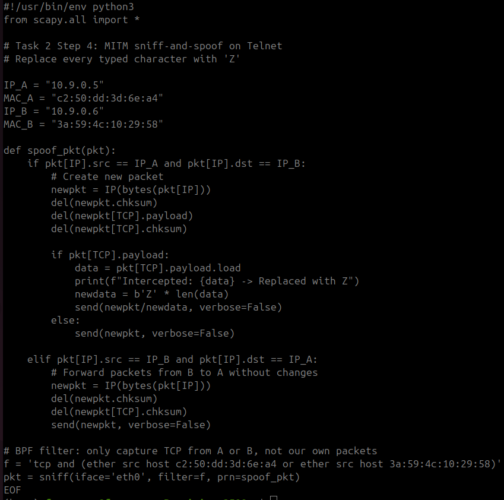

The script works as follows:

- **A → B traffic:** The packet is rebuilt from its IP layer (preserving sequence numbers and flags), the original payload is removed, checksums are deleted (so the kernel recalculates them), and the payload is replaced with `Z` characters of the same length. The modified packet is sent at layer 3 with `send()`.
- **B → A traffic:** The packet is forwarded unchanged, with only the checksums recalculated.
- **BPF filter:** The filter `tcp and (ether src host ... or ether src host ...)` captures only TCP packets originating from A's or B's MAC addresses. 

**Result:** When typing on the Telnet session from A, every character appeared as "Z" on B. The MITM script output showed each intercepted byte being replaced.

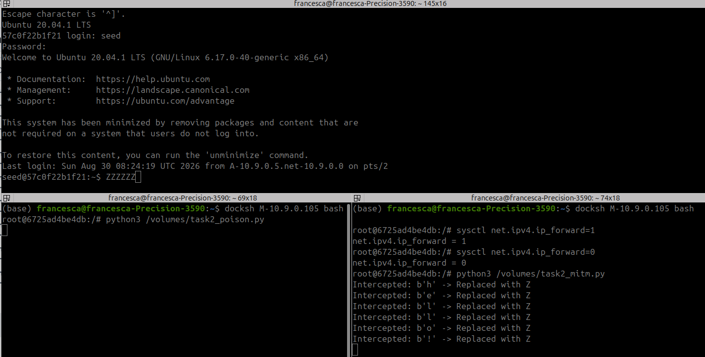

---

## 4. Task 3: MITM Attack on Netcat

Task 3 applies the same MITM technique to a Netcat session. Instead of replacing every character, the script selectively replaces the name "Francesca" with "AAAAAAAAA" (same length: 9 characters). Keeping the replacement the same length is critical to avoid breaking TCP sequence numbers.

### 4.1 Procedure

The procedure mirrors Task 2's step-by-step order, adapted for Netcat:

1. **M** (terminal 1): Run `python3 /volumes/task2_poison.py` (bidirectional ARP poisoning)
2. **M** (terminal 2): Set `sysctl net.ipv4.ip_forward=1`
3. **B**: Start Netcat listener: `nc -lp 9090`
4. **A**: Connect to B: `nc 10.9.0.6 9090`
5. **M** (terminal 2): Set `sysctl net.ipv4.ip_forward=0`
6. **M** (terminal 2): Run `python3 /volumes/task3_netcat.py`
7. **A**: Type messages containing "Francesca"

The connection must be established before disabling forwarding, just like in Task 2. The same `task2_poison.py` script is reused for the ARP poisoning.

### 4.2 MITM Script

**Script (`task3_netcat.py`):**

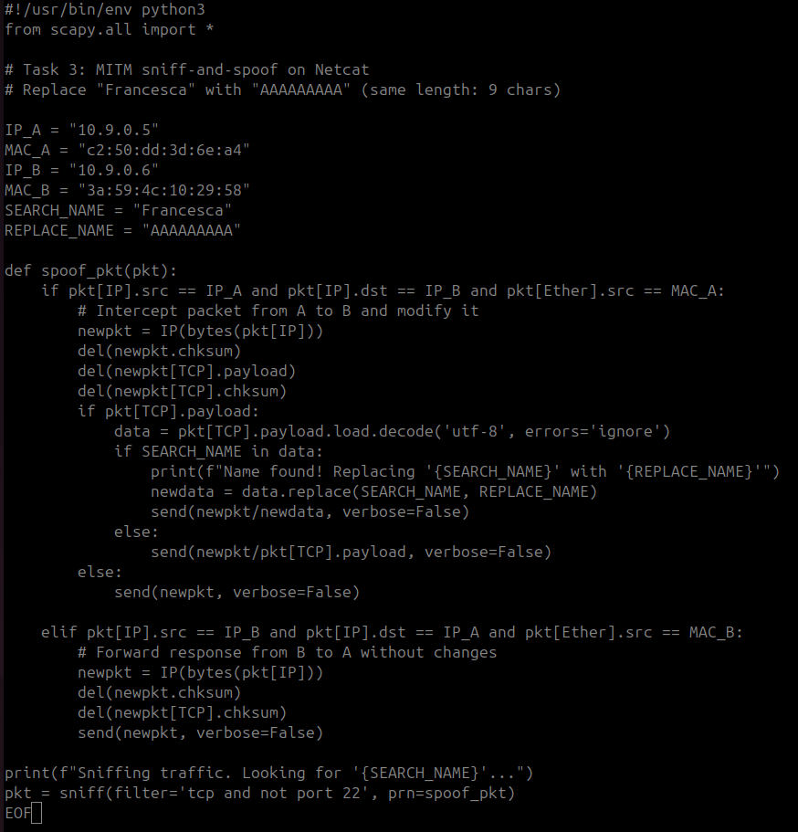

Compared to the Telnet MITM script, the key differences are:

- **Selective replacement:** Instead of replacing all data with "Z", the script decodes the TCP payload as UTF-8 and checks whether it contains "Francesca". If found, it replaces the name with "AAAAAAAAA". If not, the original payload is forwarded unchanged.
- **MAC address check:** The if-conditions additionally verify `pkt[Ether].src` to ensure only packets genuinely originating from A or B are processed, filtering out the script's own re-injected packets.
- **Same-length replacement:** "Francesca" and "AAAAAAAAA" are both 9 characters. This preserves the TCP payload length, avoiding sequence number mismatches that would break the connection.

### 4.3 Result

From A, two messages were sent: "Hi my name is Francesca" and "Francesca loves hacking!". On B, these appeared as "Hi my name is AAAAAAAAA" and "AAAAAAAAA loves hacking!" - the name was replaced while the rest of the message was preserved. The MITM script output confirmed each replacement.
Additionally, a message containing "Francesca" was sent from B to A. Since the MITM script only modifies A-to-B traffic, the message arrived at A unaltered, confirming that B-to-A traffic is forwarded without any modification.

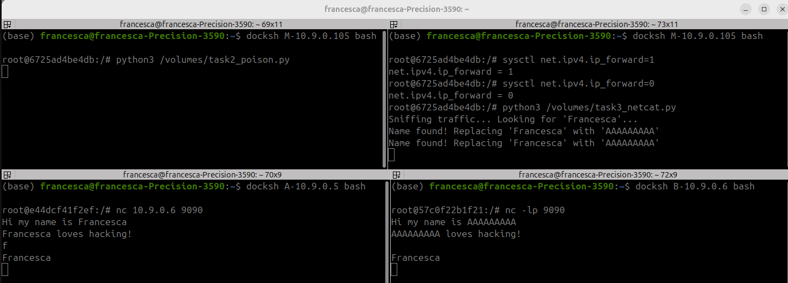

---

## 5. Conclusions

The lab demonstrated the complete ARP cache poisoning attack chain, from basic cache manipulation to full traffic interception and modification.

Task 1 showed that ARP Request packets are the most versatile poisoning method, capable of creating new cache entries even when the victim's cache is empty. ARP Reply and Gratuitous ARP can only overwrite existing entries, making them less reliable for initial poisoning but still effective when the victim has recently communicated with the target.

Tasks 2 and 3 demonstrated that once bidirectional ARP poisoning is in place, the attacker gains full control over the traffic between two hosts. By combining Scapy's packet sniffing and spoofing capabilities with careful IP forwarding management, the attacker can intercept, read, and modify any unencrypted application-layer data in real time - whether replacing every keystroke in a Telnet session or selectively altering specific content in a Netcat stream.
