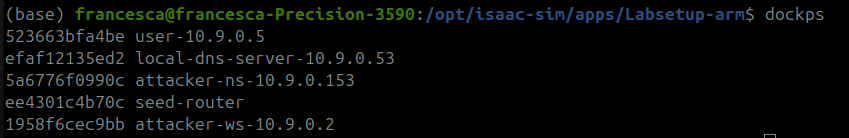
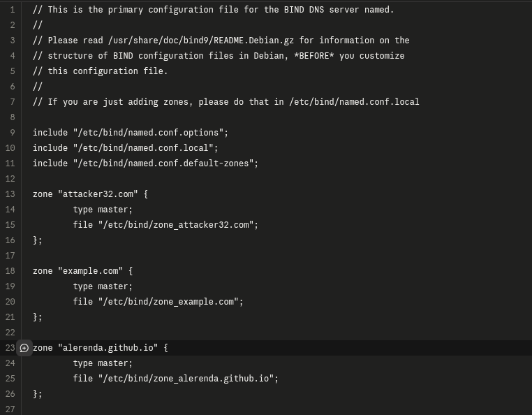
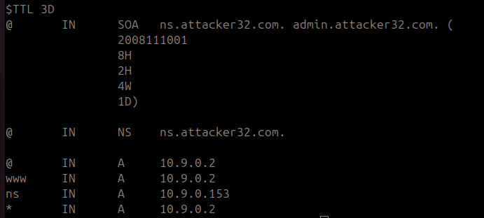
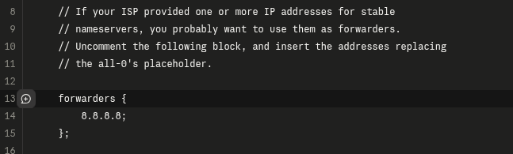
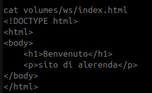
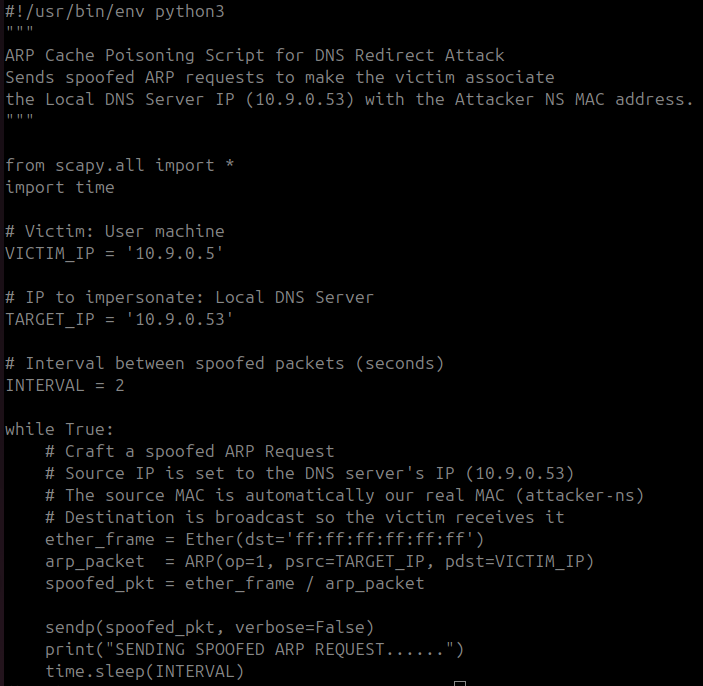
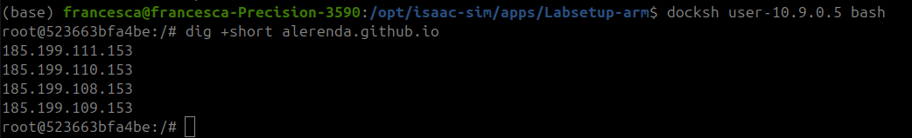
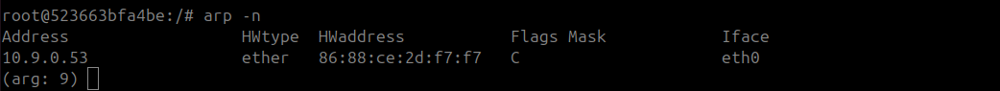
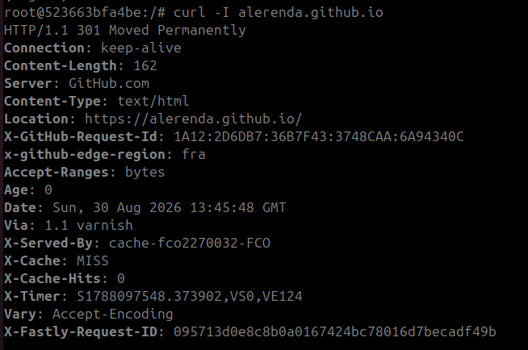
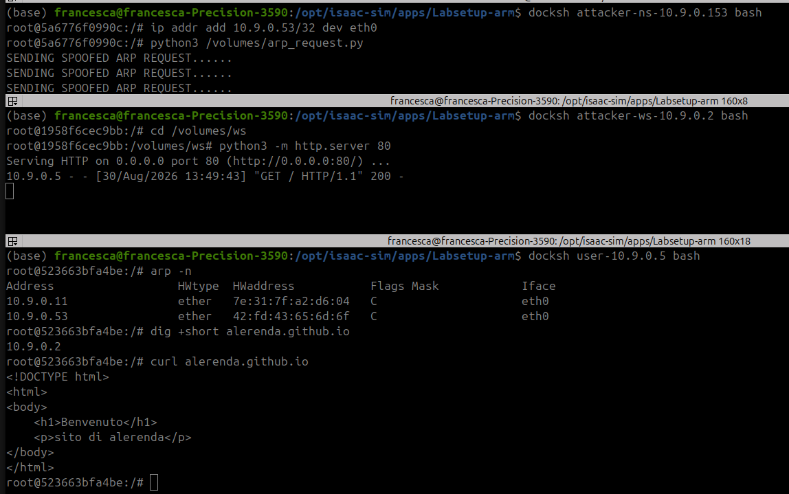

# Lab 06 - Adversary-in-the-Middle: DNS Redirect via ARP Spoofing

**Course:** [505MI] Cybersecurity Lab A.Y. 2025/2026  
**Author:** Francesca Craievich  
**Tools:** Scapy (Python 3), BIND 9, Docker (SEED Labs DNS_Local infrastructure)

---

## 1. Introduction

This report documents an optional lab exercise that combines ARP Cache Poisoning (from Lab 06_AITM_2) with DNS infrastructure to perform a DNS Redirect attack. The goal is to redirect a victim's DNS queries to a malicious nameserver by poisoning the victim's ARP cache, so that the attacker can serve fake web content for a legitimate domain.

The attack chain works as follows: the Attacker's Nameserver (10.9.0.153) sends spoofed ARP requests to the User (10.9.0.5), making it believe that the Local DNS Server's IP (10.9.0.53) is associated with the Attacker NS's MAC address. Once the ARP cache is poisoned, DNS queries from the User are routed to the Attacker NS instead of the legitimate DNS server. The Attacker NS is configured with a BIND zone for `alerenda.github.io` that resolves to 10.9.0.2 (the Attacker's web server), which serves a fake page.

**Environment:** The lab uses the SEED Labs DNS_Local infrastructure (Labsetup-arm), slightly modified as proposed in the course slides. Five Docker containers run on the `10.9.0.0/24` network on Ubuntu (kernel 6.17.0-40-generic):

| Host | IP | Role |
|---|---|---|
| User | 10.9.0.5 | Victim machine |
| Local DNS Server | 10.9.0.53 | Legitimate recursive DNS (forwards to 8.8.8.8) |
| Router | 10.9.0.11 / 10.8.0.11 | Gateway with NAT |
| Attacker NS | 10.9.0.153 | Malicious BIND nameserver (zone: `alerenda.github.io`) |
| Attacker WS | 10.9.0.2 | Malicious web server (Python HTTP) |




## 2. Setup Modifications

The original SEED Labs DNS_Local Labsetup-arm is designed for DNS Cache Poisoning experiments. For this lab, the following modifications were made to support the DNS Redirect via ARP Spoofing attack.

### 2.1 Attacker NS - Zone Configuration

A new zone for `alerenda.github.io` was added to the Attacker NS's `named.conf`:



The zone entry at line 23 tells BIND to serve the zone file `/etc/bind/zone_alerenda.github.io`. The corresponding zone file contains the DNS records that make the redirect possible:



The key records are: `@ IN A 10.9.0.2` and `www IN A 10.9.0.2`, which resolve `alerenda.github.io` to the Attacker WS. The wildcard record `* IN A 10.9.0.2` ensures that any subdomain also resolves to the attacker. The `ns IN A 10.9.0.153` record points to the Attacker NS itself as the authoritative nameserver. The zone file and its zone declaration in `named.conf` were also added to the Attacker NS Dockerfile's `COPY` instruction so they are included in the container image at build time.

### 2.2 Local DNS Server - Forwarders

The Local DNS Server's `named.conf.options` was configured with a forwarder to `8.8.8.8` (Google Public DNS), so that it can resolve external domains recursively before the attack:



### 2.3 Attacker WS - Fake Web Page

A simple HTML page was created at `volumes/ws/index.html` to be served by the Attacker WS:



### 2.4 ARP Spoofing Script

The ARP spoofing script (`arp_request.py`) was placed in the shared `volumes/` directory, accessible from the Attacker NS container at `/volumes/arp_request.py`:



The script uses Scapy to send spoofed ARP Requests every 2 seconds. Each request claims that the Local DNS Server's IP (`10.9.0.53`) belongs to the Attacker NS's MAC address. The broadcast destination ensures the User receives the packet and updates its ARP cache. This is the same ARP Request technique demonstrated in Lab 06_AITM_2, Task 1A - the most effective method since it poisons the cache regardless of its initial state.

---

## 3. Initial Setting (Before Attack)

Before launching the attack, the following commands were executed from the **User container** (10.9.0.5) to establish the baseline behavior.

### 3.1 DNS Resolution - dig

```
dig +short alerenda.github.io
```



The DNS query returns the four real GitHub Pages IP addresses. The Local DNS Server correctly forwarded the query to Google DNS and cached the legitimate response.

### 3.2 ARP Cache - arp -n

```
arp -n
```



The ARP cache shows the real MAC address of the Local DNS Server: `86:88:ce:2d:f7:f7` for IP `10.9.0.53`. This is the value that will change after ARP poisoning.

### 3.3 HTTP Response - curl -I

```
curl -I alerenda.github.io
```



The HTTP HEAD request reaches the real GitHub Pages server, which responds with `HTTP/1.1 301 Moved Permanently` and `Server: GitHub.com`, redirecting to the HTTPS version. This confirms that DNS resolution and routing are working normally.

---

## 4. Attack Execution and Verification

The attack requires three terminals operating simultaneously. The following screenshot shows all three terminals after the attack succeeded:



### 4.1 Terminal 1 - Attacker NS (10.9.0.153)

From the Attacker NS container, two commands were executed:

```
ip addr add 10.9.0.53/32 dev eth0
python3 /volumes/arp_request.py
```

The first command adds the Local DNS Server's IP (`10.9.0.53`) as a secondary address on the Attacker NS's network interface. This is necessary because once the User's ARP cache is poisoned, DNS packets destined for `10.9.0.53` will arrive at the Attacker NS (correct MAC), but the kernel would drop them if it does not recognize `10.9.0.53` as one of its own addresses. By adding this IP, the kernel accepts the packets and passes them to BIND, which responds with the malicious zone data.

The second command launches the ARP spoofing script, which continuously sends spoofed ARP Requests to poison the User's cache (visible in the top terminal: "SENDING SPOOFED ARP REQUEST......").

### 4.2 Terminal 2 - Attacker WS (10.9.0.2)

From the Attacker WS container, a Python HTTP server was started:

```
cd /volumes/ws
python3 -m http.server 80
```

This serves the fake `index.html` page on port 80. After the User's request arrives, the server logs: `10.9.0.5 - - "GET / HTTP/1.1" 200 -` (visible in the middle terminal).

### 4.3 Terminal 3 - User Verification (10.9.0.5)

With both attacker components running, the following verification commands were executed from the User container (bottom terminal).

**ARP Cache - Poisoned:**

```
arp -n
```

The User's ARP cache now shows two entries:

| Address | MAC | Notes |
|---|---|---|
| 10.9.0.11 | `7e:31:7f:a2:d6:04` | Router (legitimate) |
| 10.9.0.53 | `42:fd:43:65:6d:6f` | **Attacker NS MAC** (was `86:88:ce:2d:f7:f7`) |

The MAC address for `10.9.0.53` has changed from the real Local DNS Server's MAC (`86:88:ce:2d:f7:f7`) to the Attacker NS's MAC (`42:fd:43:65:6d:6f`). The ARP poisoning is active.

**DNS Resolution - Redirected:**

```
dig +short alerenda.github.io
```

The query now returns **`10.9.0.2`** instead of the four GitHub IPs. The DNS request was sent to `10.9.0.53` (as configured in the User's `resolv.conf`), but due to the poisoned ARP cache, it was delivered to the Attacker NS, which responded with its malicious zone data pointing to the Attacker WS.

**HTTP Response - Fake Page:**

```
curl alerenda.github.io
```

Instead of the GitHub Pages 301 redirect, the User now receives the fake HTML page served by the Attacker WS:

```html
<!DOCTYPE html>
<html>
<body>
    <h1>Benvenuto</h1>
    <p>sito di alerenda</p>
</body>
</html>
```
